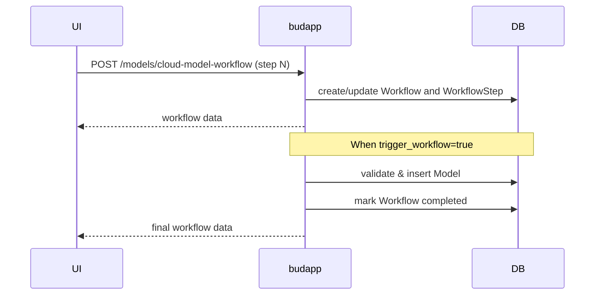
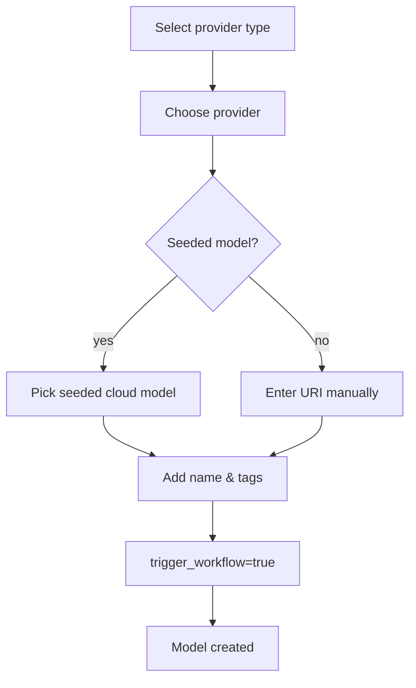
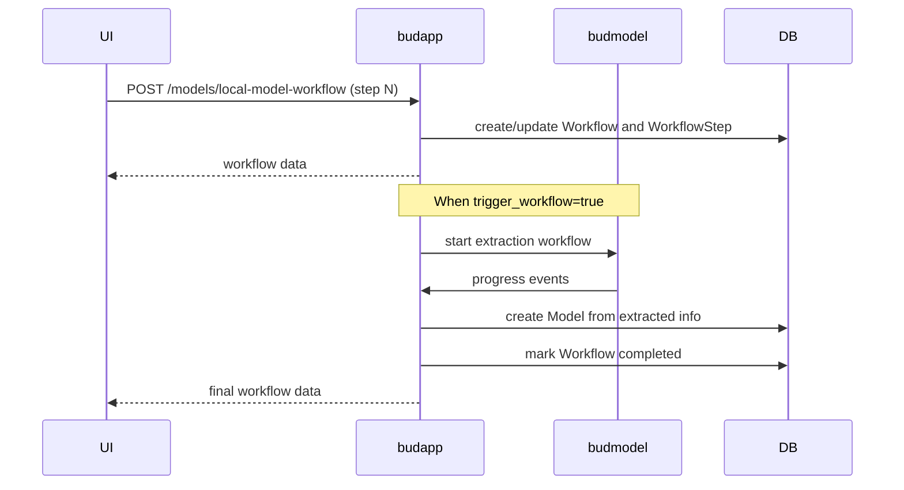
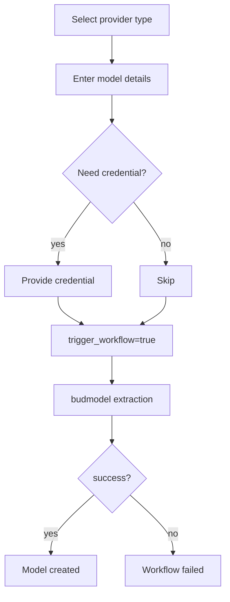
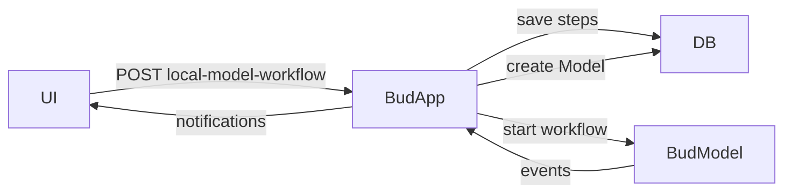
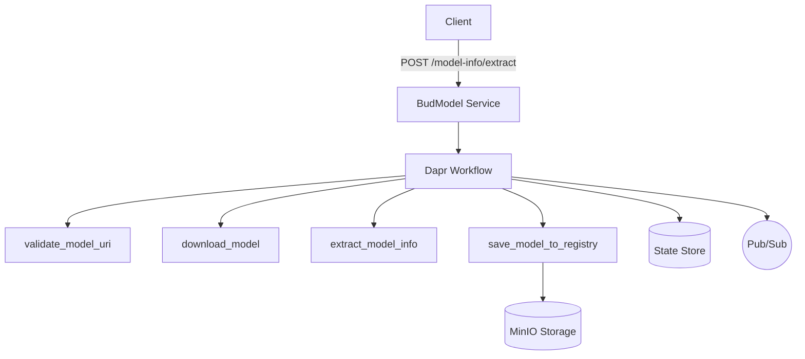
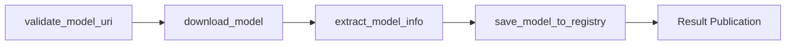
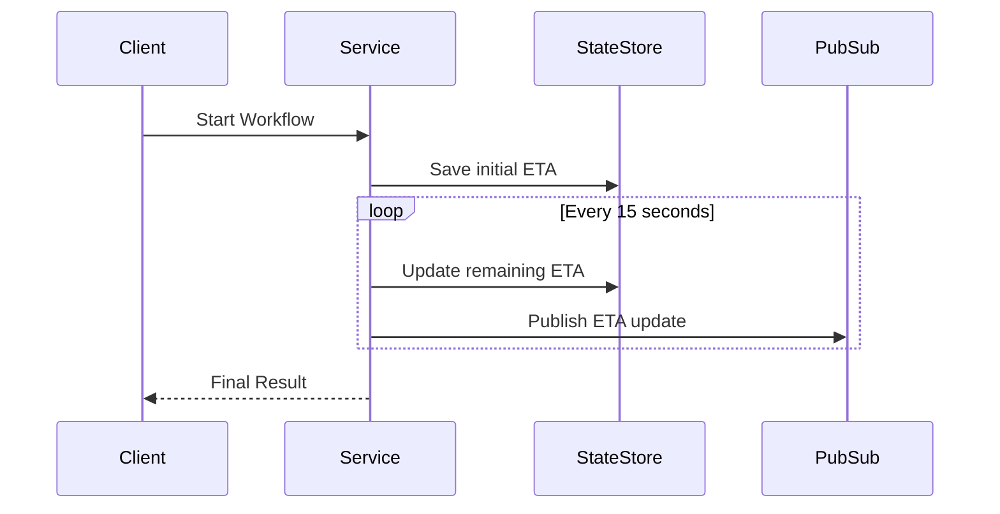

# Model Onboarding (BudApp)

This document provides comprehensive guidance on onboarding new models using the Bud Serve App's workflow APIs. Two main POST endpoints are exposed by the backend to facilitate adding a model in incremental steps.

- `POST /models/cloud-model-workflow` &ndash; add a **proprietary ** model from a provider such as OpenAI or Anthropic.
- `POST /models/local-model-workflow` &ndash; add a **local** model from HuggingFace, a direct URL or an existing directory on disk.

Each endpoint expects a small JSON payload describing the current step in the workflow. The frontend will call the endpoint multiple times, progressing from step 1 to the final confirmation step. A `workflow_id` is returned on the first call and must be supplied for all following calls. This allows the backend to store progress and resume if the user revisits the form later.

---

## Cloud Model Workflow

The cloud model workflow is used when adding a model hosted by a cloud provider. The user selects a provider and optionally chooses from seeded models. The workflow is complete once the model is created in the Bud application model repository.

### Steps Overview

1. **Choose Provider Type** &ndash; specify `provider_type="cloud_model"`.
2. **Select Provider** &ndash; choose one of the available providers by `provider_id`.
3. **Select Cloud Model** &ndash; either select a seeded model (`cloud_model_id`) or skip for manual input.
4. **Model Details** &ndash; provide `name`, `tags`, optional `modality` and `uri`, then set `trigger_workflow=true` to finalize.

At each step the workflow service validates the input and stores the step data in the database. When `trigger_workflow` is true, a new model is created. The service compiles the stored steps, inserts the model, marks the workflow completed and returns a workflow object.

### Sequence Diagram



### Flowchart



### Notifications

The cloud workflow is relatively short, The final model appears immediately in the UI.

## Local Model Workflow

The local model workflow is meant for models that must be downloaded or copied to the Budmodel. This includes HuggingFace models, direct download links and models already stored on the cluster disk. Because downloading and extracting can take time, the workflow stores progress and provides live status updates.

### Steps Overview

1. **Choose Provider Type** &ndash; `hugging_face`, `url` or `disk`.
2. **Model Details** &ndash; provide `name`, `uri` (repo ID, URL or folder path), optional `author`, `tags` and `icon`.
3. **Optional Credential** &ndash; for gated/private HuggingFace models supply `proprietary_credential_id`.
4. **Trigger Extraction** &ndash; set `trigger_workflow=true` to start the extraction process.

Once triggered, `LocalModelWorkflowService` initiates a background workflow in the **budmodel** microservice. The Dapr workflow runs several activities: validating the URI, downloading files, extracting metadata, creating model licenses and finally saving the model to the registry. Events from each activity are streamed back to the frontend so the user can monitor progress.

### Sequence Diagram



### Flowchart



### Live Notifications

While the budmodel microservice performs the extraction workflow, it emits events on every activity completion. Budapp listens to these events, finalizes the model creation once the extraction result is available. The frontend receives these updates via server-sent events and displays progress with an estimated time remaining.

A typical sequence of events is:

1. `validate_uri_completed`
2. `download_completed`
3. `extract_info_completed`
4. `model_saved`

If any step fails, an error event is emitted and the workflow status becomes `failed`.

---

## Extracted Model Metadata

Budmodel extracts rich metadata about the model and sends it back to Bud Serve in the final event payload. The metadata includes but is not limited to:

- **Description** – a short summary of the model.
- **Strengths / Limitations** – bullet points describing what the model excels at and where it may perform poorly.
- **Suitable Use Cases** – example scenarios where the model has been used successfully.
- **License details** – including license name, description, URL and a list of frequently asked questions.
- **Languages** – list of languages supported by the model.
- **Technical Specifications** – parsed from the model's `config.json` such as number of parameters, hidden size, context length, and other architecture fields.
- **Modality** – classification of the model as `llm`, `mllm`, vision, audio, etc. This informs the API which endpoints the model can serve.
- **Model Tree Information** – identifies the base model and indicates whether the uploaded model is an adapter, a fine-tuned version, quantised weights, a merged checkpoint or a true base model.
- **Supported Endpoints** – list of endpoints supported by the model.

## Architecture Diagram

The following diagram shows the overall architecture when adding a local model.


---

## Resuming Workflows

If the user reloads the page or leaves the form, they can resume by calling the same endpoint with the `workflow_id` returned earlier and the correct `step_number`. The stored steps are merged with the new data. Once completed, the workflow record is kept for audit purposes but further calls with the same id will be rejected.

---

## Conclusion

The Bud Serve App exposes two powerful workflow endpoints to manage the complex process of adding cloud and local models. By splitting the process into discrete steps with clear validations, the UI can guide the user, resume progress and display live updates. The local workflow integrates with budmodel to extract rich metadata and manage long-running downloads, while the cloud workflow offers a quick way to register cloud-hosted models.

# Model Extraction (BudModel)

This document provides a comprehensive overview of the Model Extraction feature in the budmodel microservice. It outlines the API contract, internal workflows using Dapr orchestration, ETA calculations, and state and pubsub mechanisms. This document is primarily aimed at developers and system designers integrating or maintaining this functionality.

## Overview

The **BudModel** microservice is built to support automated model extraction tasks. When a user provides information about a model—such as its name, location, and provider—the service validates and retrieves the model, extracts relevant metadata, and stores everything in a centralized registry. This microservice operates as part of the larger Bud ecosystem, relying on **Dapr** for workflow orchestration, state management, and pub/sub messaging.

Key goals of the service include:

- Provide a consistent API for submitting model extraction requests.
- Handle various provider types including cloud-based models, Hugging Face repositories,
  external URLs, and local disk paths.
- Calculate and update processing time estimates so clients can track progress.
- Use Dapr workflows to orchestrate tasks reliably and scalably.
- Store interim state data and publish updates to interested subscribers.



### Activity Flow



## API Endpoint

The primary API endpoint for triggering a model extraction is `POST /model-info/extract`.

### Request Schema

```json
{
  "model_name": "string",
  "model_uri": "string",
  "provider_type": "cloud_model | hugging_face | url | disk",
  "hf_token": "string | null"
}
```

- `model_name`: A friendly name for the model.
- `model_uri`: The location of the model. This varies based on the provider type.
- `provider_type`: Indicates the source of the model. Allowed values are:
  - `cloud_model`
  - `hugging_face`
  - `url`
  - `disk`
- `hf_token`: Optional Hugging Face token when accessing private repositories.

### Response Schema

```json
{
  "message": "Extraction workflow started",
  "workflow_id": "UUID",
  "eta_seconds": 123
}
```

The response returns an initial estimate of the time required to complete the extraction along with a
workflow identifier. Clients can use this identifier to track progress.

## Workflow Architecture

The extraction is orchestrated using **Dapr Workflows**. When a new request arrives, the service
initiates a workflow containing several activities. These activities run in sequence, each updating
the estimated time of arrival (ETA) for the entire process. If any activity fails, the workflow logs
an error and surfaces it to the client.

The main activities are as follows:

1. `validate_model_uri`
2. `download_model`
3. `extract_model_info`
4. `save_model_to_registry`

The following sections describe each activity in more detail.

## Step Details

### validate_model_uri

The first step ensures that the model URI is accessible and valid. Depending on the provider type,
different validation logic applies.

- **Hugging Face**: The service checks the repository ID using the Hugging Face API and verifies
  that the provided token grants access.
- **URL**: The service validates that the URL is well-formed and reachable.
- **Disk**: The service confirms that the specified directory or file exists.

Based on the provider type, a baseline validation time is added to the ETA. Historically, network-based validations (Hugging Face or URL) take slightly longer than disk checks. The step writes to the state store with `current_step='validate_model_uri'` and the remaining ETA

### download_model

After validation, the service downloads the model to a designated directory on the client side. The
download approach depends on the provider type.

- **Hugging Face**:
  - The service retrieves the list of files from the Hugging Face API.
  - It then downloads the repository using the `huggingface_hub` snapshot utilities.
  - The download rate is measured to predict the remaining time.
  - ETA updates use the formula `remaining_bytes / speed`. If the speed fluctuates, the ETA is recalculated accordingly.
- **URL**:
  - The service uses the `aria2p` package for HTTP/FTP downloads.
  - `aria2p` handles the download. The package exposes an ETA value directly, which we read at
     intervals.
  - Upon completion, if the file is a ZIP archive, we use Python’s `zipfile` module to extract it and monitor extraction speed. The time taken is added to the remaining ETA.
- **Disk**:
  - The service copies or moves the model from a local path to the download directory.
  - The ETA is calculated based on the observed transfer speed.
  - The service copies files using `shutil.copytree` or `shutil.copy2`.
  - If the file is zipped, `zipfile` extraction is used just like in the URL case. Transfer speed is monitored to adjust the ETA.

The step writes progress information to the state store, including the number of bytes transferred and estimated remaining time.

### extract_model_info

Once the model files are available locally, the service extracts metadata. This can include license
information, model configuration, weights, and other details. The process differs for cloud-based or
Hugging Face models and local models.

For Hugging Face models, extraction steps include:

- Gathering descriptions, use cases, advantages, and disadvantages from the README via a language
  model prompt.
- Fetching tags, tasks, papers, website URLs, and license details using Hugging Face APIs.
- Determining modality and architecture from the `config.json` file.
- Estimating model weight sizes from metadata and git repository information.
- Using a static prompt, the service runs a small language model to generate frequently asked questions about the license. This text is included in the final output.

Local models follow a similar pattern if required files (README, license, `config.json`) are found in
predefined directories. A missing `config.json` or weight file results in an error.

Metadata is stored in the state store. The ETA is updated, typically decreasing by a large portion at this stage.

### save_model_to_registry

- The service uploads all files to MinIO or an equivalent object store. Upload speed is monitored, and large files (>1 GB) are removed locally after upload.
- The `.cache` directory is deleted to free space.
- Temporary files are removed.
- Once upload completes, the service constructs the final response, which includes the object name in storage and all extracted metadata.
- The workflow state is marked as completed, and the remaining ETA reaches zero.

# ETA

## Initial ETA Calculation

The initial ETA is calculated when the workflow starts. Each activity contributes an estimated time
based on average durations from previous runs. Here is a simplified approach used to compute the
ETA:

1. **Base Estimations**: For each activity, the service keeps a history of durations. If historical
   data exists, it uses the median or average time. Otherwise, default values are applied.
2. **Dynamic Adjustments**: During runtime, actual metrics (like download speed) can adjust future
   estimates. For example, if the download speed is slower than average, the system recalculates the
   remaining time.
3. **Accumulation**: The initial ETA is the sum of each activity’s estimated duration. This value is
   returned in the response and stored in the state store for reference.

## Dynamic ETA Updates

As each activity progresses, the service updates the remaining ETA in the state store. This allows external systems to query the latest ETA at any time.

The state entries are typically stored under a key pattern like `model-extraction:{workflow_id}`. Each entry may include fields such as:
- `current_step`
- `remaining_eta`
- `total_eta`
- `progress_percent`
- `last_update`

To keep clients informed of progress, the service publishes ETA updates to a pub/sub topic at a
constant interval. The typical setup involves:

1. **Interval**: A background job runs every few seconds (for example, every 15 seconds). The exact
   interval is configurable based on system load and responsiveness requirements.
2. **Data**: Each published message contains the workflow ID, the current step, the remaining ETA in
   seconds, and a timestamp.
3. **Pub/Sub Component**: Dapr’s pub/sub building block handles delivery. Subscribers can listen on
   the topic to receive real-time updates.

This ensures that any interested component—whether a user interface or another service—can react to progress changes promptly.

### State Update Cycle



The combination of Dapr workflows, state management, and pub/sub messaging ensures reliable and
observable model extraction. The ETA calculation helps clients gauge progress, while state-store
persistence allows the service to recover gracefully from unexpected interruptions.