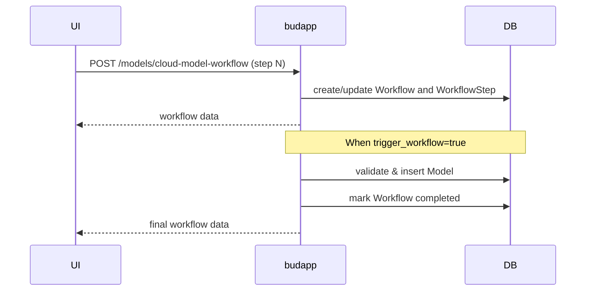
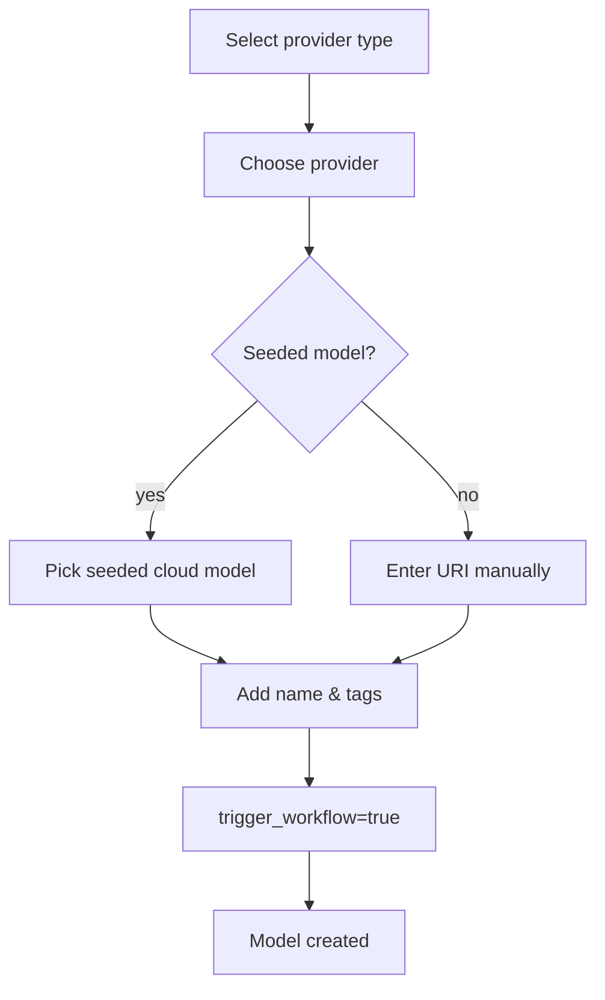
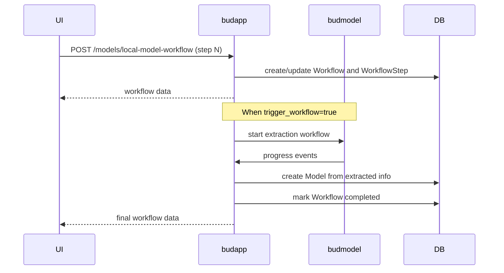
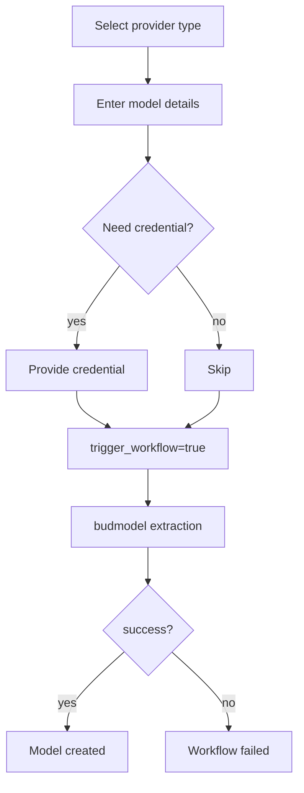

# Model Onboarding

This document provides comprehensive guidance on onboarding new models using the Bud Serve App's workflow APIs. Two main POST endpoints are exposed by the backend to facilitate adding a model in incremental steps.

- `POST /models/cloud-model-workflow` &ndash; add a **proprietary ** model from a provider such as OpenAI or Anthropic.
- `POST /models/local-model-workflow` &ndash; add a **local** model from HuggingFace, a direct URL or an existing directory on disk.

Each endpoint expects a small JSON payload describing the current step in the workflow. The frontend will call the endpoint multiple times, progressing from step 1 to the final confirmation step. A `workflow_id` is returned on the first call and must be supplied for all following calls. This allows the backend to store progress and resume if the user revisits the form later.

---

## Cloud Model Workflow

The cloud model workflow is used when adding a model hosted by a cloud provider. The user selects a provider and optionally chooses from seeded models. The workflow is complete once the model is created in the Bud application model repository.

### Steps Overview

1. **Choose Provider Type** &ndash; specify `provider_type="cloud_model"`.
2. **Select Provider** &ndash; choose one of the available providers by `provider_id`.
3. **Select Cloud Model** &ndash; either select a seeded model (`cloud_model_id`) or skip for manual input.
4. **Model Details** &ndash; provide `name`, `tags`, optional `modality` and `uri`, then set `trigger_workflow=true` to finalize.

At each step the workflow service validates the input and stores the step data in the database. When `trigger_workflow` is true, a new model is created. The service compiles the stored steps, inserts the model, marks the workflow completed and returns a workflow object.

### Sequence Diagram



### Flowchart



### Notifications

The cloud workflow is relatively short, The final model appears immediately in the UI.

## Local Model Workflow

The local model workflow is meant for models that must be downloaded or copied to the Budmodel. This includes HuggingFace models, direct download links and models already stored on the cluster disk. Because downloading and extracting can take time, the workflow stores progress and provides live status updates.

### Steps Overview

1. **Choose Provider Type** &ndash; `hugging_face`, `url` or `disk`.
2. **Model Details** &ndash; provide `name`, `uri` (repo ID, URL or folder path), optional `author`, `tags` and `icon`.
3. **Optional Credential** &ndash; for gated/private HuggingFace models supply `proprietary_credential_id`.
4. **Trigger Extraction** &ndash; set `trigger_workflow=true` to start the extraction process.

Once triggered, `LocalModelWorkflowService` initiates a background workflow in the **budmodel** microservice. The Dapr workflow runs several activities: validating the URI, downloading files, extracting metadata, creating model licenses and finally saving the model to the registry. Events from each activity are streamed back to the frontend so the user can monitor progress.

### Sequence Diagram



### Flowchart



### Live Notifications

While the budmodel microservice performs the extraction workflow, it emits events on every activity completion. Budapp listens to these events, finalizes the model creation once the extraction result is available. The frontend receives these updates via server-sent events and displays progress with an estimated time remaining.

A typical sequence of events is:

1. `validate_uri_completed`
2. `download_completed`
3. `extract_info_completed`
4. `model_saved`

If any step fails, an error event is emitted and the workflow status becomes `failed`.

---

## Extracted Model Metadata

Budmodel extracts rich metadata about the model and sends it back to Bud Serve in the final event payload. The metadata includes but is not limited to:

- **Description** – a short summary of the model.
- **Strengths / Limitations** – bullet points describing what the model excels at and where it may perform poorly.
- **Suitable Use Cases** – example scenarios where the model has been used successfully.
- **License details** – including license name, description, URL and a list of frequently asked questions.
- **Languages** – list of languages supported by the model.
- **Technical Specifications** – parsed from the model's `config.json` such as number of parameters, hidden size, context length, and other architecture fields.
- **Modality** – classification of the model as `llm`, `mllm`, vision, audio, etc. This informs the API which endpoints the model can serve.
- **Model Tree Information** – identifies the base model and indicates whether the uploaded model is an adapter, a fine-tuned version, quantised weights, a merged checkpoint or a true base model.
- **Supported Endpoints** – list of endpoints supported by the model.

## Architecture Diagram

The following diagram shows the overall architecture when adding a local model.

```mermaid
graph LR
    UI -->|POST local-model-workflow| BudApp
    BudApp -->|save steps| DB
    BudApp -->|start workflow| BudModel
    BudModel -->|events| BudApp
    BudApp -->|create Model| DB
    BudApp -->|notifications| UI
}
```
---

## Resuming Workflows

If the user reloads the page or leaves the form, they can resume by calling the same endpoint with the `workflow_id` returned earlier and the correct `step_number`. The stored steps are merged with the new data. Once completed, the workflow record is kept for audit purposes but further calls with the same id will be rejected.

---

## Conclusion

The Bud Serve App exposes two powerful workflow endpoints to manage the complex process of adding cloud and local models. By splitting the process into discrete steps with clear validations, the UI can guide the user, resume progress and display live updates. The local workflow integrates with budmodel to extract rich metadata and manage long-running downloads, while the cloud workflow offers a quick way to register cloud-hosted models.