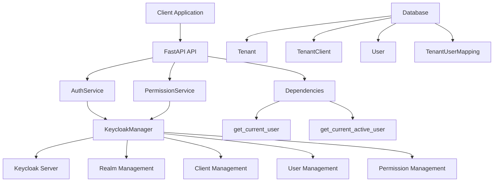
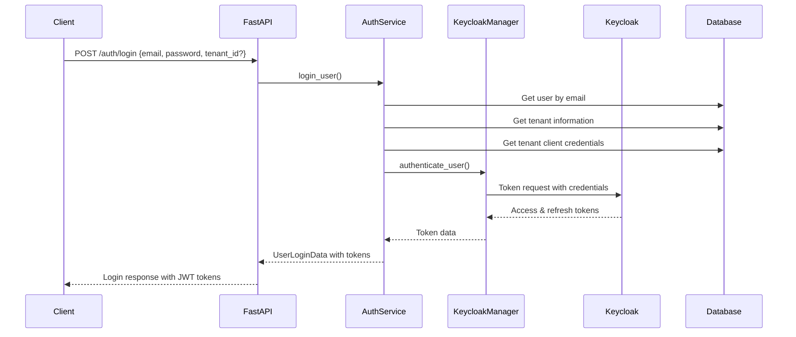

# Keycloak Integration Documentation

## Table of Contents
1. [Overview](#overview)
2. [Architecture](#architecture)
3. [Configuration](#configuration)
4. [Authentication Flow](#authentication-flow)
5. [Authorization System](#authorization-system)
6. [Keycloak Manager](#keycloak-manager)
7. [Multi-Tenancy Support](#multi-tenancy-support)
8. [Permission Management](#permission-management)
9. [API Dependencies](#api-dependencies)
10. [Utilities and Helpers](#utilities-and-helpers)
11. [Security Features](#security-features)
12. [Troubleshooting](#troubleshooting)

## Overview

The Bud Serve App implements a comprehensive authentication and authorization system using **Keycloak** as the identity and access management solution. The integration provides:

- **Multi-tenant authentication** with realm-based isolation
- **Role-based access control (RBAC)** with fine-grained permissions
- **Resource-level authorization** using Keycloak's Authorization Services
- **JWT token management** with refresh token support
- **User lifecycle management** including registration, password updates, and user management

### Key Components

- **KeycloakManager**: Singleton class managing all Keycloak operations
- **AuthService**: Handles user authentication and token management
- **PermissionService**: Manages resource-level permissions and authorization
- **Dependencies**: FastAPI dependency injection for authentication and authorization

## Architecture



## Configuration

### Environment Variables

The Keycloak integration requires the following environment variables:

```bash
# Keycloak Server Configuration
KEYCLOAK_SERVER_URL=http://localhost:8080
KEYCLOAK_ADMIN_USERNAME=admin
KEYCLOAK_ADMIN_PASSWORD=admin_password
KEYCLOAK_REALM_NAME=master
KEYCLOAK_VERIFY_SSL=true

# Default Realm
DEFAULT_REALM_NAME=bud

# Token Configuration
ACCESS_TOKEN_EXPIRE_MINUTES=30
REFRESH_TOKEN_EXPIRE_MINUTES=10080  # 7 days

# Superuser Configuration
SUPER_USER_EMAIL=admin@bud.studio
SUPER_USER_PASSWORD=admin_password
```

### Configuration Classes

#### AppConfig
Located in `budapp/commons/config.py`:

```python
class AppConfig(BaseAppConfig):
    # Keycloak Configuration
    keycloak_server_url: str = Field(alias="KEYCLOAK_SERVER_URL")
    keycloak_admin_username: str = Field(alias="KEYCLOAK_ADMIN_USERNAME")
    keycloak_admin_password: str = Field(alias="KEYCLOAK_ADMIN_PASSWORD")
    keycloak_realm_name: str = Field(alias="KEYCLOAK_REALM_NAME")
    keycloak_verify_ssl: bool = Field(True, alias="KEYCLOAK_VERIFY_SSL")
    
    # Default realm for multi-tenancy
    default_realm_name: str = Field(alias="DEFAULT_REALM_NAME", default="bud")
    
    # Token expiration settings
    access_token_expire_minutes: int = Field(30, alias="ACCESS_TOKEN_EXPIRE_MINUTES")
    refresh_token_expire_minutes: int = Field(60 * 24 * 7, alias="REFRESH_TOKEN_EXPIRE_MINUTES")
```

## Authentication Flow

### 1. User Login Process



#### Login Implementation

```python
# budapp/auth/services.py
async def login_user(self, user: UserLogin) -> UserLoginData:
    """Login a user with email and password."""
    
    # 1. Validate user exists in database
    db_user = await UserDataManager(self.session).retrieve_by_fields(
        UserModel, {"email": user.email}, missing_ok=True
    )
    
    # 2. Determine tenant (multi-tenant support)
    if user.tenant_id:
        # Specific tenant login
        tenant = await self._get_tenant_by_id(user.tenant_id)
        await self._verify_user_tenant_mapping(db_user.id, user.tenant_id)
    else:
        # Default tenant login
        tenant = await self._get_default_tenant()
    
    # 3. Get tenant client credentials
    tenant_client = await self._get_tenant_client(tenant.id)
    
    # 4. Authenticate with Keycloak
    keycloak_manager = KeycloakManager()
    credentials = TenantClientSchema(
        id=tenant_client.id,
        client_id=tenant_client.client_id,
        client_named_id=tenant_client.client_named_id,
        client_secret=tenant_client.client_secret,
    )
    
    token_data = await keycloak_manager.authenticate_user(
        username=user.email,
        password=user.password,
        realm_name=tenant.realm_name,
        credentials=credentials,
    )
    
    return UserLoginData(
        token=token_data,
        first_login=db_user.first_login,
        is_reset_password=db_user.is_reset_password,
    )
```

### 2. Token Refresh Process

```python
async def refresh_token(self, token: RefreshTokenRequest) -> RefreshTokenResponse:
    """Refresh a user's access token using their refresh token."""
    
    # Get default tenant
    tenant = await self._get_default_tenant()
    tenant_client = await self._get_tenant_client(tenant.id)
    
    # Prepare credentials
    keycloak_manager = KeycloakManager()
    credentials = TenantClientSchema(
        id=tenant_client.id,
        client_id=tenant_client.client_id,
        client_named_id=tenant_client.client_named_id,
        client_secret=tenant_client.client_secret,
    )
    
    # Refresh token with Keycloak
    token_data = await keycloak_manager.refresh_token(
        realm_name=tenant.realm_name,
        credentials=credentials,
        refresh_token=token.refresh_token,
    )
    
    return RefreshTokenResponse(
        code=status.HTTP_200_OK,
        message="Token refreshed successfully",
        token=token_data,
    )
```

### 3. User Registration

```python
async def register_user(self, user: UserCreate) -> UserModel:
    """Register a new user with Keycloak integration."""
    
    # 1. Check if email already exists
    email_exists = await UserDataManager(self.session).retrieve_by_fields(
        UserModel, {"email": user.email}, missing_ok=True
    )
    if email_exists:
        raise ClientException("Email already registered")
    
    # 2. Get default tenant and client
    tenant = await self._get_default_tenant()
    tenant_client = await self._get_tenant_client(tenant.id)
    
    # 3. Create user in Keycloak with permissions
    keycloak_manager = KeycloakManager()
    user_auth_id = await keycloak_manager.create_user_with_permissions(
        user, app_settings.default_realm_name, tenant_client.client_id
    )
    
    # 4. Create user in database
    user_data = user.model_dump(exclude={"permissions"})
    user_data["color"] = UserColorEnum.get_random_color()
    user_data["status"] = UserStatusEnum.INVITED
    
    user_model = UserModel(**user_data)
    user_model.auth_id = user_auth_id
    
    db_user = await UserDataManager(self.session).insert_one(user_model)
    return db_user
```

## Authorization System

### Role-Based Access Control (RBAC)

The system implements a hierarchical role system:

```python
# budapp/commons/constants.py
class UserRoleEnum(str, Enum):
    SUPER_ADMIN = "super_admin"
    ADMIN = "admin"
    DEVELOPER = "developer"
    TESTER = "tester"
    DEVOPS = "devops"
```

### Resource-Based Permissions

The authorization system supports both **module-level** and **resource-level** permissions:

#### Module-Level Permissions
- Format: `module_{module_name}` (e.g., `module_cluster`, `module_model`)
- Scopes: `view`, `manage`

#### Resource-Level Permissions
- Format: `URN::{resource_type}::{resource_id}` (e.g., `URN::project::123`)
- Scopes: `view`, `manage`

### Permission Checking

```python
# budapp/permissions/service.py
async def check_resource_permission_by_user(
    self, user: UserModel, payload: CheckUserResourceScope
) -> bool:
    """Check if a user has a resource permission."""
    
    # Get user's roles and permissions from Keycloak
    result = await keycloak_manager.get_user_roles_and_permissions(
        user.auth_id,
        realm_name,
        tenant_client.client_id,
        credentials,
        user.raw_token,
    )
    
    if payload.entity_id is None:
        # Global/Module Permission Check
        for permission in result["permissions"]:
            if (
                permission["rsname"] == f"module_{payload.resource_type}"
                and payload.scope in permission["scopes"]
            ):
                return True
    else:
        # Individual Resource Permission Check
        for permission in result["permissions"]:
            if (
                permission["rsname"] == f"URN::{payload.resource_type}::{payload.entity_id}"
                and payload.scope in permission["scopes"]
            ):
                return True
    
    return False
```

## Keycloak Manager

The `KeycloakManager` class is the core component that handles all Keycloak operations. It implements the **Singleton pattern** to ensure a single instance throughout the application lifecycle.

### Key Features

1. **Singleton Pattern**: Ensures single instance across the application
2. **Realm Management**: Create and manage Keycloak realms
3. **Client Management**: Create and configure OAuth2 clients
4. **User Management**: Create, update, and manage users
5. **Permission Management**: Handle resource-level permissions
6. **Token Operations**: Validate, refresh, and manage JWT tokens

### Core Methods

#### Realm Operations

```python
async def create_realm(self, realm_name: str) -> dict:
    """Create a new realm in Keycloak with default configuration."""
    realm_representation = {
        "realm": realm_name.lower(),
        "enabled": True,
        "sslRequired": "external",
        "registrationAllowed": False,
        "loginWithEmailAllowed": True,
        "duplicateEmailsAllowed": False,
        "resetPasswordAllowed": True,
        "editUsernameAllowed": False,
        "bruteForceProtected": True,
    }
    
    # Create realm and default roles
    self.admin_client.create_realm(payload=realm_representation, skip_exists=True)
    
    # Create default roles for the realm
    realm_admin = self.get_realm_admin(realm_name)
    roles = [UserRoleEnum.ADMIN.value, UserRoleEnum.DEVELOPER.value, ...]
    
    for role_name in roles:
        realm_admin.create_realm_role(
            {"name": role_name, "description": f"Role: {role_name}"}, 
            skip_exists=True
        )
```

#### Client Operations

```python
async def create_client(self, client_id: str, realm_name: str) -> Tuple[str, str]:
    """Create a new OAuth2 client in Keycloak."""
    client_representation = {
        "clientId": client_id,
        "enabled": True,
        "protocol": "openid-connect",
        "publicClient": False,
        "redirectUris": ["*"],
        "webOrigins": ["*"],
        "authorizationServicesEnabled": True,
        "serviceAccountsEnabled": True,
    }
    
    realm_admin = self.get_realm_admin(realm_name)
    new_client_id = realm_admin.create_client(payload=client_representation)
    secrets = realm_admin.get_client_secrets(new_client_id)
    client_secret = secrets.get("value", "")
    
    # Create default resources and permissions
    modules = ["cluster", "model", "project", "user"]
    for module in modules:
        await self._create_module_resource(realm_admin, new_client_id, module, realm_name)
    
    return new_client_id, client_secret
```

#### User Operations

```python
async def create_user_with_permissions(
    self, user: UserCreate, realm_name: str, client_id: str
) -> str:
    """Create a new user with specific permissions in Keycloak."""
    user_representation = {
        "username": user.email,
        "email": user.email,
        "firstName": user.name,
        "lastName": user.name,
        "enabled": True,
        "emailVerified": True,
        "credentials": [{"type": "password", "value": user.password, "temporary": False}],
    }
    
    realm_admin = self.get_realm_admin(realm_name)
    user_id = realm_admin.create_user(payload=user_representation)
    
    # Assign realm role
    roles = realm_admin.get_realm_roles()
    admin_role = next((r for r in roles if r["name"] == user.role.value), None)
    realm_admin.assign_realm_roles(user_id=user_id, roles=[admin_role])
    
    # Create user-specific permissions
    if user.permissions:
        await self._create_user_permissions(user_id, user.permissions, realm_admin, client_id)
    
    return user_id
```

#### Token Operations

```python
async def authenticate_user(
    self, username: str, password: str, realm_name: str, credentials: TenantClientSchema
) -> dict:
    """Authenticate a user and return access & refresh tokens."""
    try:
        openid_client = self.get_keycloak_openid_client(realm_name, credentials)
        token = openid_client.token(username, password, scope="openid profile email roles")
        return token
    except KeycloakAuthenticationError:
        logger.warning(f"Invalid credentials for user {username}")
        return {}

async def validate_token(
    self, token: str, realm_name: str, credentials: TenantClientSchema
) -> dict:
    """Validate a JWT token and return the decoded payload."""
    openid_client = self.get_keycloak_openid_client(realm_name, credentials)
    decoded_token = openid_client.decode_token(token)
    return decoded_token

async def refresh_token(
    self, realm_name: str, credentials: TenantClientSchema, refresh_token: str
) -> dict:
    """Refresh the access token using the refresh token."""
    openid_client = self.get_keycloak_openid_client(realm_name, credentials)
    new_token = openid_client.refresh_token(refresh_token)
    return new_token
```

## Multi-Tenancy Support

The system supports multi-tenancy through Keycloak realms, where each tenant has its own realm with isolated users, roles, and permissions.

### Database Schema

```python
# Tenant Model
class Tenant(Base):
    __tablename__ = "tenants"
    
    id: Mapped[UUID] = mapped_column(Uuid, primary_key=True, default=uuid4)
    name: Mapped[str] = mapped_column(String, nullable=False)
    realm_name: Mapped[str] = mapped_column(String, nullable=False)  # Keycloak realm name
    is_active: Mapped[bool] = mapped_column(Boolean, default=True)

# Tenant Client Model (OAuth2 Client per tenant)
class TenantClient(Base):
    __tablename__ = "tenant_clients"
    
    id: Mapped[UUID] = mapped_column(Uuid, primary_key=True, default=uuid4)
    tenant_id: Mapped[UUID] = mapped_column(Uuid, ForeignKey("tenants.id"))
    client_id: Mapped[str] = mapped_column(String, nullable=False)  # Internal UUID
    client_named_id: Mapped[str] = mapped_column(String, nullable=False)  # Human-readable ID
    client_secret: Mapped[str] = mapped_column(String, nullable=False)

# User-Tenant Mapping
class TenantUserMapping(Base):
    __tablename__ = "tenant_user_mappings"
    
    id: Mapped[UUID] = mapped_column(Uuid, primary_key=True, default=uuid4)
    tenant_id: Mapped[UUID] = mapped_column(Uuid, ForeignKey("tenants.id"))
    user_id: Mapped[UUID] = mapped_column(Uuid, ForeignKey("users.id"))
```

### Tenant Initialization

The system automatically creates a default tenant during initialization:

```python
# budapp/initializers/base_keycloak_seeder.py
async def _seed_keycloak(session: Session) -> None:
    """Initialize Keycloak with default realm, client, and admin user."""
    keycloak_manager = KeycloakManager()
    
    # 1. Create default realm
    if not keycloak_manager.realm_exists(default_realm_name):
        await keycloak_manager.create_realm(default_realm_name)
    
    # 2. Create/update tenant in database
    tenant = await UserDataManager(session).retrieve_by_fields(
        Tenant, {"realm_name": default_realm_name}, missing_ok=True
    )
    if not tenant:
        tenant_data = Tenant(
            name="Default Tenant",
            realm_name=default_realm_name,
            is_active=True
        )
        tenant = await UserDataManager(session).insert_one(tenant_data)
    
    # 3. Create OAuth2 client
    new_client_id, client_secret = await keycloak_manager.create_client(
        default_client_id, default_realm_name
    )
    
    # 4. Store client credentials
    tenant_client_data = TenantClient(
        tenant_id=tenant.id,
        client_id=new_client_id,
        client_named_id=default_client_id,
        client_secret=client_secret
    )
    await UserDataManager(session).insert_one(tenant_client_data)
    
    # 5. Create admin user
    keycloak_user_id = await keycloak_manager.create_realm_admin(
        username=app_settings.superuser_email,
        email=app_settings.superuser_email,
        password=app_settings.superuser_password,
        realm_name=default_realm_name,
        client_id=new_client_id,
        client_secret=client_secret
    )
```

## Permission Management

### Resource Creation with Permissions

```python
async def create_resource_with_permissions(
    self,
    realm_name: str,
    client_id: str,
    resource: ResourceCreate,
    user_auth_id: str,
) -> None:
    """Create a resource with associated permissions in Keycloak."""
    
    realm_admin = self.get_realm_admin(realm_name)
    
    # 1. Create the resource
    resource_representation = {
        "name": f"URN::{resource.resource_type}::{resource.resource_id}",
        "type": resource.resource_type,
        "owner": {"id": client_id},
        "ownerManagedAccess": True,
        "displayName": f"{resource.resource_type} {resource.resource_id}",
        "scopes": [{"name": scope} for scope in resource.scopes],
    }
    
    resource_id = realm_admin.create_client_authz_resource(client_id, resource_representation)
    
    # 2. Create user policy
    policy_name = f"urn:bud:policy:{user_auth_id}"
    user_policy = {
        "name": policy_name,
        "description": f"User policy for {user_auth_id}",
        "logic": "POSITIVE",
        "users": [user_auth_id],
    }
    
    # 3. Create permissions for each scope
    for scope in resource.scopes:
        permission_name = f"urn:bud:permission:{resource.resource_type}:{resource.resource_id}:{scope}"
        permission = {
            "name": permission_name,
            "description": f"Permission for {resource.resource_type} {resource.resource_id} to {scope}",
            "type": "scope",
            "logic": "POSITIVE",
            "decisionStrategy": "UNANIMOUS",
            "resources": [resource_id],
            "policies": [policy_name],
            "scopes": [scope],
        }
        
        realm_admin.create_client_authz_permission(client_id, permission)
```

### Permission Retrieval

```python
async def get_user_roles_and_permissions(
    self,
    user_id: str,
    realm_name: str,
    client_id: str,
    credentials: TenantClientSchema,
    token: str,
) -> Dict[str, List[str]]:
    """Get user roles and permissions using UMA (User-Managed Access)."""
    
    keycloak_openid = self.get_keycloak_openid_client(realm_name, credentials)
    
    # Get OIDC configuration
    oidc_config = keycloak_openid.well_known()
    token_endpoint = oidc_config.get("token_endpoint")
    
    # Request RPT (Requesting Party Token)
    headers = {
        "Authorization": f"Bearer {token}",
        "Content-Type": "application/x-www-form-urlencoded",
    }
    payload = {
        "grant_type": "urn:ietf:params:oauth:grant-type:uma-ticket",
        "audience": credentials.client_named_id,
    }
    
    response = requests.post(token_endpoint, headers=headers, data=payload)
    rpt_response_data = response.json()
    requesting_party_token = rpt_response_data.get("access_token")
    
    # Decode RPT to extract permissions
    rpt_payload = self._decode_jwt_payload(requesting_party_token)
    raw_permissions = rpt_payload.get("authorization", {}).get("permissions", [])
    
    # Format permissions for easier consumption
    formatted_permissions = []
    for perm in raw_permissions:
        formatted_permissions.append({
            "rsid": perm.get("rsid"),
            "rsname": perm.get("rsname"),
            "scopes": perm.get("scopes", [])
        })
    
    return {
        "roles": rpt_payload.get("realm_access", {}).get("roles", []),
        "permissions": formatted_permissions
    }
```

## API Dependencies

The system uses FastAPI dependency injection to handle authentication and authorization:

### Authentication Dependencies

```python
# budapp/commons/dependencies.py

security = HTTPBearer()

async def get_current_user(
    token: Annotated[HTTPAuthorizationCredentials, Depends(security)],
    session: Session = Depends(get_session),
) -> User:
    """Extract and validate the current user from JWT token."""
    
    credentials_exception = HTTPException(
        status_code=status.HTTP_401_UNAUTHORIZED,
        detail="Invalid authentication credentials",
        headers={"WWW-Authenticate": "Bearer"},
    )
    
    try:
        # Get default tenant and client credentials
        realm_name = app_settings.default_realm_name
        tenant = await UserDataManager(session).retrieve_by_fields(
            Tenant, {"realm_name": realm_name, "is_active": True}, missing_ok=True
        )
        
        tenant_client = await UserDataManager(session).retrieve_by_fields(
            TenantClient, {"tenant_id": tenant.id}, missing_ok=True
        )
        
        credentials = TenantClientSchema(
            id=tenant_client.id,
            client_named_id=tenant_client.client_named_id,
            client_id=tenant_client.client_id,
            client_secret=tenant_client.client_secret,
        )
        
        # Validate token with Keycloak
        manager = KeycloakManager()
        payload = await manager.validate_token(token.credentials, realm_name, credentials)
        
        # Extract user ID from token
        auth_id: str = payload.get("sub")
        if not auth_id:
            raise credentials_exception
        
        # Get user from database
        db_user = await UserDataManager(session).retrieve_by_fields(
            UserModel, {"auth_id": auth_id}, missing_ok=True
        )
        
        if not db_user:
            raise credentials_exception
        
        # Store raw token for permission checks
        db_user.raw_token = token.credentials
        return db_user
        
    except ExpiredSignatureError:
        raise HTTPException(
            status_code=status.HTTP_401_UNAUTHORIZED,
            detail="Token has expired",
            headers={"WWW-Authenticate": "Bearer"},
        )
    except (JWTError, KeycloakInvalidTokenError):
        raise credentials_exception
    except (KeycloakAuthenticationError, KeycloakGetError):
        raise HTTPException(
            status_code=status.HTTP_503_SERVICE_UNAVAILABLE,
            detail="Authentication service unavailable",
        )

async def get_current_active_user(
    current_user: Annotated[User, Depends(get_current_user)]
) -> User:
    """Ensure the current user is active."""
    if current_user.status != UserStatusEnum.ACTIVE:
        raise HTTPException(
            status_code=status.HTTP_400_BAD_REQUEST, 
            detail="Inactive user"
        )
    return current_user
```

### Usage in API Routes

```python
from fastapi import Depends
from budapp.commons.dependencies import get_current_active_user

@router.get("/protected-endpoint")
async def protected_endpoint(
    current_user: User = Depends(get_current_active_user)
):
    """Example of a protected endpoint."""
    return {"message": f"Hello {current_user.email}"}

@router.post("/resource/{resource_id}")
async def manage_resource(
    resource_id: str,
    current_user: User = Depends(get_current_active_user),
    permission_service: PermissionService = Depends()
):
    """Example of resource-level authorization."""
    
    # Check if user has manage permission for this resource
    has_permission = await permission_service.check_resource_permission_by_user(
        user=current_user,
        payload=CheckUserResourceScope(
            resource_type="project",
            entity_id=resource_id,
            scope="manage"
        )
    )
    
    if not has_permission:
        raise HTTPException(
            status_code=status.HTTP_403_FORBIDDEN,
            detail="Insufficient permissions"
        )
    
    # Proceed with resource management
    return {"message": "Resource managed successfully"}
```

## Utilities and Helpers

### Token Utilities

```python
def _decode_jwt_payload(self, token: str) -> dict:
    """Decode JWT token payload without verification."""
    try:
        # Split the token and decode the payload
        parts = token.split('.')
        if len(parts) != 3:
            raise ValueError("Invalid JWT token format")
        
        # Decode the payload (second part)
        payload = parts[1]
        # Add padding if necessary
        payload += '=' * (4 - len(payload) % 4)
        decoded_bytes = base64.urlsafe_b64decode(payload)
        return json.loads(decoded_bytes.decode('utf-8'))
    except Exception as e:
        logger.error(f"Error decoding JWT payload: {str(e)}")
        return {}
```

### Permission Formatting

```python
def format_permissions_output(self, resources, user_permissions):
    """Format permissions for API response."""
    user_permission_names = {perm["name"] for perm in user_permissions}
    
    formatted_resources = []
    for resource in resources:
        resource_name = resource.get("name", "")
        
        # Check if user has permissions for this resource
        has_view = f"urn:bud:permission:{resource_name}:view" in user_permission_names
        has_manage = f"urn:bud:permission:{resource_name}:manage" in user_permission_names
        
        formatted_resource = {
            **resource,
            "permissions": {
                "view": has_view,
                "manage": has_manage
            }
        }
        formatted_resources.append(formatted_resource)
    
    return formatted_resources
```

### Resource Annotation

```python
def annotate_resources_with_permissions(
    self, resources: List[Dict], user_permissions: List[Dict]
) -> List[Dict]:
    """Annotate resources with user permissions."""
    
    # Create permission lookup map
    permission_map = {}
    for perm in user_permissions:
        resource_name = perm.get("rsname", "")
        scopes = perm.get("scopes", [])
        permission_map[resource_name] = scopes
    
    # Annotate each resource
    annotated_resources = []
    for resource in resources:
        resource_id = resource.get("id")
        resource_type = resource.get("type", "unknown")
        
        # Check module-level permissions
        module_key = f"module_{resource_type}"
        module_scopes = permission_map.get(module_key, [])
        
        # Check resource-level permissions
        resource_key = f"URN::{resource_type}::{resource_id}"
        resource_scopes = permission_map.get(resource_key, [])
        
        # Combine permissions (resource-level overrides module-level)
        combined_scopes = list(set(module_scopes + resource_scopes))
        
        annotated_resource = {
            **resource,
            "permissions": {
                "view": "view" in combined_scopes,
                "manage": "manage" in combined_scopes
            }
        }
        annotated_resources.append(annotated_resource)
    
    return annotated_resources
```

## Security Features

### 1. Token Security

- **JWT Tokens**: Stateless authentication using JSON Web Tokens
- **Token Expiration**: Configurable access and refresh token expiration
- **Token Refresh**: Secure token refresh mechanism
- **Token Validation**: Server-side token validation with Keycloak

### 2. Password Security

- **Keycloak Password Policies**: Leverages Keycloak's built-in password policies
- **Password Updates**: Secure password update mechanism
- **Temporary Passwords**: Support for temporary passwords during user creation

### 3. SSL/TLS Configuration

```python
# SSL verification can be configured
keycloak_verify_ssl: bool = Field(True, alias="KEYCLOAK_VERIFY_SSL")
```

### 4. Brute Force Protection

```python
# Enabled in realm configuration
"bruteForceProtected": True
```

### 5. CORS Configuration

```python
# CORS origins configuration
cors_origins: Annotated[list[AnyUrl] | str, BeforeValidator(parse_cors)] = []
```

## Troubleshooting

### Common Issues and Solutions

#### 1. Token Validation Errors

**Problem**: `KeycloakInvalidTokenError` or `ExpiredSignatureError`

**Solutions**:
- Check token expiration settings
- Verify Keycloak server connectivity
- Ensure correct realm and client configuration
- Check system clock synchronization

```python
# Debug token validation
try:
    payload = await manager.validate_token(token, realm_name, credentials)
except ExpiredSignatureError:
    logger.warning("Token has expired - user needs to refresh")
except KeycloakInvalidTokenError as e:
    logger.error(f"Invalid token: {str(e)}")
```

#### 2. Permission Denied Errors

**Problem**: Users cannot access resources they should have access to

**Solutions**:
- Verify user role assignments in Keycloak
- Check resource permissions configuration
- Validate permission scope mappings
- Review UMA token generation

```python
# Debug permission checking
result = await keycloak_manager.get_user_roles_and_permissions(
    user.auth_id, realm_name, client_id, credentials, user.raw_token
)
logger.debug(f"User permissions: {result}")
```

#### 3. Multi-Tenant Issues

**Problem**: Users accessing wrong tenant or tenant isolation failures

**Solutions**:
- Verify tenant-user mappings in database
- Check realm configuration in Keycloak
- Validate client credentials per tenant
- Review tenant selection logic

```python
# Debug tenant resolution
tenant_mapping = await UserDataManager(session).retrieve_by_fields(
    TenantUserMapping, {"user_id": user.id}, missing_ok=True
)
logger.debug(f"User tenant mapping: {tenant_mapping}")
```

#### 4. Keycloak Connection Issues

**Problem**: `KeycloakAuthenticationError` or connection timeouts

**Solutions**:
- Verify Keycloak server URL and accessibility
- Check admin credentials
- Validate network connectivity
- Review SSL/TLS configuration

```python
# Test Keycloak connectivity
try:
    realms = keycloak_manager.admin_client.get_realms()
    logger.info(f"Connected to Keycloak, found {len(realms)} realms")
except Exception as e:
    logger.error(f"Keycloak connection failed: {str(e)}")
```

### Logging and Monitoring

The system provides comprehensive logging for troubleshooting:

```python
# Enable debug logging for Keycloak operations
logger.debug(f"::KEYCLOAK::User {user_id} roles and permissions: {result}")
logger.debug(f"::USER:: Token validated: {payload}")
logger.debug(f"::PERMISSION::Checking permissions for user: {user.raw_token}")
```

### Health Checks

Implement health checks to monitor Keycloak connectivity:

```python
async def health_check_keycloak():
    """Check Keycloak server health."""
    try:
        keycloak_manager = KeycloakManager()
        realms = keycloak_manager.admin_client.get_realms()
        return {"status": "healthy", "realms_count": len(realms)}
    except Exception as e:
        return {"status": "unhealthy", "error": str(e)}
```

## Best Practices

1. **Token Management**:
   - Always validate tokens on protected endpoints
   - Implement proper token refresh logic
   - Store tokens securely on the client side

2. **Permission Design**:
   - Use hierarchical permissions (module → resource)
   - Implement least privilege principle
   - Regular permission audits

3. **Multi-Tenancy**:
   - Ensure proper tenant isolation
   - Validate tenant access on every request
   - Use realm-based separation

4. **Error Handling**:
   - Provide meaningful error messages
   - Log security events for auditing
   - Implement proper exception handling

5. **Performance**:
   - Cache user permissions when possible
   - Use connection pooling for Keycloak
   - Implement proper session management

This documentation provides a comprehensive overview of the Keycloak integration in the Bud Serve App. For specific implementation details, refer to the source code in the respective modules. 