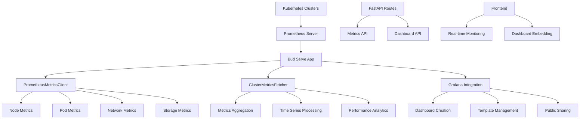

# Prometheus & Grafana Monitoring Documentation

## Table of Contents
1. [Overview](#overview)
2. [Architecture](#architecture)
3. [Configuration](#configuration)
4. [Prometheus Integration](#prometheus-integration)
5. [Metrics Collection](#metrics-collection)
6. [Grafana Dashboard Management](#grafana-dashboard-management)
7. [Dashboard Templates](#dashboard-templates)
8. [API Endpoints](#api-endpoints)
9. [Monitoring Workflows](#monitoring-workflows)
10. [Custom Metrics](#custom-metrics)
11. [Alerting and Notifications](#alerting-and-notifications)
12. [Performance Optimization](#performance-optimization)
13. [Troubleshooting](#troubleshooting)
14. [Best Practices](#best-practices)

## Overview

The Bud Serve App implements a comprehensive monitoring and observability solution using **Prometheus** for metrics collection and **Grafana** for visualization and dashboarding. The system provides:

- **Real-time cluster monitoring** with node-level metrics
- **Automated dashboard creation** for each cluster
- **Multi-dimensional metrics** including CPU, memory, storage, network, and power consumption
- **Time-series data analysis** with configurable time ranges
- **Public dashboard sharing** for external access
- **RESTful API** for programmatic metrics access

### Key Components

- **PrometheusMetricsClient**: Core client for querying Prometheus metrics
- **ClusterMetricsFetcher**: Advanced metrics aggregation and processing
- **Grafana**: Dashboard management and visualization
- **Metrics Services**: Business logic for metrics operations
- **Dashboard Templates**: Pre-configured dashboard definitions

## Architecture



## Configuration

### Environment Variables

The monitoring system requires the following environment variables:

```bash
# Prometheus Configuration
PROMETHEUS_URL=https://metrics.fmops.in

# Grafana Configuration
GRAFANA_SCHEME=https
GRAFANA_URL=grafana.bud.studio
GRAFANA_USERNAME=admin
GRAFANA_PASSWORD=admin_password

# Microservices Configuration
DAPR_BASE_URL=http://localhost:3500
BUD_CLUSTER_APP_ID=bud-cluster
BUD_METRICS_APP_ID=bud-metrics
```

### Configuration Classes

#### AppConfig
Located in `budapp/commons/config.py`:

```python
class AppConfig(BaseAppConfig):
    # Prometheus Configuration
    prometheus_url: str = Field(alias="PROMETHEUS_URL", default="https://metrics.fmops.in")
    
    # Grafana Configuration
    grafana_scheme: str = Field(alias="GRAFANA_SCHEME")
    grafana_url: str = Field(alias="GRAFANA_URL")
    grafana_username: str = Field(alias="GRAFANA_USERNAME")
    grafana_password: str = Field(alias="GRAFANA_PASSWORD")
    
    # Microservices
    dapr_base_url: AnyHttpUrl = Field(alias="DAPR_BASE_URL")
    bud_cluster_app_id: str = Field(alias="BUD_CLUSTER_APP_ID")
    bud_metrics_app_id: str = Field(alias="BUD_METRICS_APP_ID")
```

## Prometheus Integration

### PrometheusMetricsClient

The core client for interacting with Prometheus servers:

```python
# budapp/shared/promql_service.py
class PrometheusMetricsClient:
    def __init__(self, config: PrometheusConfig):
        self.config = config

    def query_prometheus(self, query: str) -> List[Dict]:
        """Query Prometheus for metrics in the specified cluster."""
        try:
            # Add cluster filter if specified
            if self.config.cluster_id:
                if "{" in query:
                    full_query = query.replace("}", f',cluster="{self.config.cluster_id}"}}')
                else:
                    full_query = f'{query}{{cluster="{self.config.cluster_id}"}}'
            else:
                full_query = query

            response = requests.get(
                f"{self.config.base_url}/api/v1/query", 
                params={"query": full_query}
            )

            if response.status_code != 200:
                raise HTTPException(
                    status_code=response.status_code,
                    detail={
                        "code": response.status_code,
                        "type": "PrometheusQueryError",
                        "message": f"Prometheus query failed: {response.text}",
                    },
                )

            data = response.json()
            return data["data"]["result"]
        except Exception as e:
            raise HTTPException(
                status_code=HTTPStatus.INTERNAL_SERVER_ERROR,
                detail={
                    "code": HTTPStatus.INTERNAL_SERVER_ERROR,
                    "type": "PrometheusQueryError",
                    "message": f"Unexpected error during Prometheus query: {str(e)}",
                },
            )
```

### Query Types

#### Instant Queries
For current metric values:

```python
def query_prometheus(self, query: str) -> List[Dict]:
    """Execute instant query against Prometheus."""
    response = requests.get(
        f"{self.config.base_url}/api/v1/query",
        params={"query": query}
    )
    return response.json()["data"]["result"]
```

#### Range Queries
For time-series data:

```python
def query_prometheus_range(
    self, query: str, start_time: int, end_time: int, step: str = "1h"
) -> List[Dict]:
    """Execute range query against Prometheus."""
    response = requests.get(
        f"{self.config.base_url}/api/v1/query_range",
        params={
            "query": query,
            "start": start_time,
            "end": end_time,
            "step": step
        }
    )
    return response.json()["data"]["result"]
```

## Metrics Collection

### ClusterMetricsFetcher

Advanced metrics collection and processing:

```python
# budapp/cluster_ops/utils.py
class ClusterMetricsFetcher:
    """Fetches cluster metrics from Prometheus."""

    def __init__(self, prometheus_url: str):
        self.prometheus_url = prometheus_url
        self.api_url = f"{prometheus_url}/api/v1"

    def _get_time_range_params(self, time_range: str, include_previous: bool = False) -> dict:
        """Get start and end timestamps based on time range."""
        now = datetime.now(timezone.utc)

        if time_range == "10min":
            start_time = now - timedelta(minutes=10)
            step = "30s"
        elif time_range == "today":
            start_time = now.replace(hour=0, minute=0, second=0, microsecond=0)
            step = "5m"
        elif time_range == "7days":
            start_time = now - timedelta(days=7)
            step = "6h"
        elif time_range == "month":
            start_time = now - timedelta(days=30)
            step = "1d"
        else:
            start_time = now - timedelta(minutes=10)
            step = "30s"

        return {
            "start": start_time.timestamp(),
            "end": now.timestamp(),
            "step": step
        }
```

### Metric Categories

#### 1. Node Information Metrics

```python
def _get_metric_queries(self, cluster_name: str) -> Dict[str, str]:
    """Get comprehensive metric queries for cluster monitoring."""
    return {
        # Node identification
        "node_uname_info": f'node_uname_info{{cluster="{cluster_name}",job="node-exporter"}}',
        
        # Memory metrics
        "memory_total": f'node_memory_MemTotal_bytes{{cluster="{cluster_name}",job="node-exporter"}}',
        "memory_available": f'node_memory_MemAvailable_bytes{{cluster="{cluster_name}",job="node-exporter"}}',
        
        # CPU metrics
        "cpu_usage": f'(1 - avg by (instance) (irate(node_cpu_seconds_total{{cluster="{cluster_name}",mode="idle",job="node-exporter"}}[5m]))) * 100',
        
        # Storage metrics
        "storage_total": f'node_filesystem_size_bytes{{cluster="{cluster_name}",mountpoint="/",job="node-exporter"}}',
        "storage_available": f'node_filesystem_avail_bytes{{cluster="{cluster_name}",mountpoint="/",job="node-exporter"}}',
        
        # Network metrics
        "network_in": f"""
            sum by (instance) (
                rate(node_network_receive_bytes_total{{
                    cluster="{cluster_name}",
                    device!~"lo|veth.*|docker.*|br.*|cni.*",
                    job="node-exporter"
                }}[5m])
            ) * 8
        """,
        "network_out": f"""
            sum by (instance) (
                rate(node_network_transmit_bytes_total{{
                    cluster="{cluster_name}",
                    device!~"lo|veth.*|docker.*|br.*|cni.*",
                    job="node-exporter"
                }}[5m])
            ) * 8
        """,
    }
```

#### 2. Node Status Monitoring

```python
def get_node_status(self) -> Dict[str, str]:
    """Get the status (Ready/NotReady) for each node."""
    try:
        # Query for ready nodes
        status_metrics = self.query_prometheus(
            'kube_node_status_condition{condition="Ready",status="true"}'
        )

        node_status = {}
        for metric in status_metrics:
            node_name = metric["metric"].get("node", "unknown")
            node_status[node_name] = "Ready"

        # Check all nodes to identify NotReady ones
        all_nodes = self.query_prometheus("node_uname_info")
        for node in all_nodes:
            node_name = node["metric"].get("nodename", "unknown")
            if node_name not in node_status:
                node_status[node_name] = "NotReady"

        return node_status
    except Exception as e:
        raise HTTPException(
            status_code=HTTPStatus.INTERNAL_SERVER_ERROR,
            detail=f"Failed to get node status: {str(e)}"
        )
```

#### 3. Pod Monitoring

```python
def get_pod_status(self) -> Dict[str, Dict]:
    """Get pod status (Available vs Desired) for each node."""
    pod_info = self.query_prometheus("kubelet_running_pods")
    pod_status = {}

    for metric in pod_info:
        node_name = metric["metric"].get("node", "unknown")
        if node_name not in pod_status:
            pod_status[node_name] = {"available": 0, "desired": 0}

        pod_count = float(metric["value"][1])
        pod_status[node_name] = {
            "available": pod_count,
            "desired": pod_count
        }

    return pod_status
```

#### 4. Memory Usage Analysis

```python
def get_node_memory_usage(self, node_ip: str) -> float:
    """Get memory usage for a node with multiple fallback metrics."""
    memory_metrics = [
        # Primary metric: Used memory calculation
        f'node_memory_MemTotal_bytes{{instance=~".*{node_ip}.*"}} - '
        f'node_memory_MemFree_bytes{{instance=~".*{node_ip}.*"}} - '
        f'node_memory_Buffers_bytes{{instance=~".*{node_ip}.*"}} - '
        f'node_memory_Cached_bytes{{instance=~".*{node_ip}.*"}}',
        
        # Fallback metrics
        f'sum(container_memory_usage_bytes{{instance=~".*{node_ip}.*"}}) by (instance)',
        f'sum(container_memory_working_set_bytes{{instance=~".*{node_ip}.*"}}) by (instance)',
        f'node_memory_Active_bytes{{instance=~".*{node_ip}.*"}}',
    ]

    for metric_query in memory_metrics:
        try:
            memory_data = self.query_prometheus(metric_query)
            if memory_data and len(memory_data) > 0:
                for metric in memory_data:
                    if "value" in metric:
                        return float(metric["value"][1])
        except Exception:
            continue

    return 0
```

#### 5. Network Bandwidth Monitoring

```python
def get_network_bandwidth(self, node_ip: str) -> List[Dict[str, Any]]:
    """Get combined network bandwidth metrics for the last 24 hours."""
    try:
        end_time = int(time.time())
        start_time = end_time - (24 * 60 * 60)

        bandwidth_query = f"""
        sum(
          rate(node_network_receive_bytes_total{{instance=~".*{node_ip}.*",device!~"lo|veth.*|docker.*|br.*|cni.*"}}[1h])
          +
          rate(node_network_transmit_bytes_total{{instance=~".*{node_ip}.*",device!~"lo|veth.*|docker.*|br.*|cni.*"}}[1h])
        ) by (instance)
        """

        bandwidth_data = self.query_prometheus_range(
            bandwidth_query, start_time, end_time, "1h"
        )
        
        bandwidth_metrics = []
        if bandwidth_data and len(bandwidth_data) > 0:
            for metric in bandwidth_data:
                if "values" in metric:
                    for value in metric["values"]:
                        timestamp = value[0]
                        bandwidth = float(value[1])
                        mbps = (bandwidth * 8) / (1024 * 1024)
                        bandwidth_metrics.append({
                            "timestamp": timestamp,
                            "mbps": round(mbps, 2)
                        })

        return bandwidth_metrics
    except Exception:
        return []
```

#### 6. Comprehensive Node Information

```python
def get_nodes_status(self) -> Dict:
    """Get comprehensive node status information in JSON format."""
    nodes, pod_counts, node_status, max_pods, pod_status = self.get_node_info()
    nodes_json = {"nodes": {}}

    for node in nodes:
        node_name = node["metric"].get("nodename", "unknown")
        node_ip = node["metric"].get("instance", "unknown").split(":")[0]

        # Get node description and capacity
        description = self.get_node_description(node_name)
        max_pods = int(float(description.get("capacity", {}).get("pods", 0)))
        cpu_capacity = description.get("capacity", {}).get("cpu", "0")

        # Calculate current CPU usage with fallbacks
        current_cpu = self._get_cpu_usage_with_fallbacks(node_ip)
        
        # Calculate memory usage
        memory_capacity = description.get("capacity", {}).get("memory", "0")
        memory_capacity_bytes = self.parse_memory_value(memory_capacity)
        current_memory = self.get_node_memory_usage(node_ip)

        # Get network and events data
        bandwidth_metrics = self.get_network_bandwidth(node_ip)
        events_count = self.get_node_events_count(node_name)

        nodes_json["nodes"][node_ip] = {
            "hostname": node_name,
            "status": node_status.get(node_name, "Unknown"),
            "system_info": {
                "os": node["metric"].get("sysname", "N/A"),
                "kernel": node["metric"].get("release", "N/A"),
                "architecture": node["metric"].get("machine", "N/A"),
            },
            "pods": {
                "current": int(pod_counts.get(node_name, 0)),
                "max": max_pods
            },
            "cpu": {
                "current": round(current_cpu, 2),
                "capacity": float(cpu_capacity)
            },
            "memory": {
                "current": round(current_memory / (1024 * 1024 * 1024), 2),
                "capacity": round(memory_capacity_bytes / (1024 * 1024 * 1024), 2),
            },
            "network": {
                "bandwidth": bandwidth_metrics
            },
            "events_count": events_count,
            "capacity": description.get("capacity", {}),
        }

    return nodes_json
```

## Grafana Dashboard Management

### Grafana Integration Class

```python
# budapp/shared/grafana.py
class Grafana:
    def __init__(self):
        """Initialize the Grafana client."""
        self.url = f"{app_settings.grafana_scheme}://{app_settings.grafana_username}:{app_settings.grafana_password}@{app_settings.grafana_url}"
        self.fixed_input_path = os.path.join(CURRENT_FILE_PATH, "templates", "grafana_dashboard.json")

    def replace_template_vars(self, obj, cluster, datasource_uid):
        """Recursively replace template variables in strings within a JSON object."""
        if isinstance(obj, dict):
            return {k: self.replace_template_vars(v, cluster, datasource_uid) for k, v in obj.items()}
        elif isinstance(obj, list):
            return [self.replace_template_vars(v, cluster, datasource_uid) for v in obj]
        elif isinstance(obj, str):
            obj = re.sub(r"\$\{cluster\}", cluster, obj)
            obj = re.sub(r"\$cluster", cluster, obj)
            obj = re.sub(r"\$\{datasource\}", datasource_uid, obj)
            obj = re.sub(r"\$datasource", datasource_uid, obj)
            return obj
        return obj

    def sanitize_dashboard(self, dashboard, cluster, datasource_uid):
        """Sanitize dashboard JSON by removing template vars and lists."""
        if "templating" in dashboard:
            dashboard["templating"]["list"] = []
        return self.replace_template_vars(dashboard, cluster, datasource_uid)
```

### Dashboard Creation Workflow

```python
def create_dashboard_from_file(self, cluster, datasource_uid, cluster_name):
    """Create a dashboard from a file."""
    logger.debug(f"Creating dashboard from file: {self.fixed_input_path}")
    
    # Load dashboard template
    dashboard_json = self.load_dashboard_json(self.fixed_input_path)
    dashboard = dashboard_json.get("dashboard", dashboard_json)

    # Update title and sanitize
    dashboard["title"] = f"{cluster_name}"
    sanitized = self.sanitize_dashboard(dashboard, cluster, datasource_uid)

    logger.debug("Dashboard Sanitized")

    title = f"{sanitized.get('title', 'Dashboard')}"
    logger.debug(f"Publishing dashboard with title: {title}")

    # Publish dashboard
    result = self.publish_dashboard(sanitized, uid=cluster, new_title=title)

    if result:
        logger.debug("Dashboard Published Successfully")
        logger.debug(f"  Title: {title}")
        logger.debug(f"  URL: {self.url}/d/{result['uid']}")
        logger.debug(f"  UID: {result['uid']}")

        # Make dashboard public
        public = self.make_dashboard_public(result["uid"])
        if public:
            logger.debug("Dashboard Made Public")
            logger.debug(f"  Public URL: {self.url}/public-dashboards/{public['accessToken']}")
```

### Dashboard Publishing

```python
def publish_dashboard(self, dashboard_json, uid, new_title=None, folder_id=None, overwrite=False):
    """Publish a dashboard to Grafana."""
    headers = {"Content-Type": "application/json"}

    dashboard = dashboard_json.copy()
    if new_title:
        dashboard["title"] = new_title

    dashboard["uid"] = uid
    dashboard.pop("id", None)

    payload = {
        "dashboard": dashboard,
        "overwrite": overwrite,
        "message": f"Dashboard created programmatically on {datetime.now().strftime('%Y-%m-%d %H:%M:%S')}",
    }

    try:
        response = requests.post(
            f"{self.url}/api/dashboards/import",
            headers=headers,
            json=payload
        )
        response.raise_for_status()
        return response.json()
    except requests.exceptions.RequestException as e:
        logger.error(f"Error publishing dashboard: {e}")
        if e.response is not None:
            logger.error(f"Response content: {e.response.text}")
        return None
```

### Public Dashboard Sharing

```python
def make_dashboard_public(self, dashboard_uid):
    """Make a Grafana dashboard publicly accessible."""
    headers = {"Content-Type": "application/json"}
    payload = {"share": "public", "isEnabled": True}

    try:
        response = requests.post(
            f"{self.url}/api/dashboards/uid/{dashboard_uid}/public-dashboards",
            headers=headers,
            json=payload
        )
        response.raise_for_status()
        return response.json()
    except requests.exceptions.RequestException as e:
        logger.error(f"Error making dashboard public: {e}")
        return None

def get_public_dashboard_url_by_uid(self, cluster_id: str):
    """Get the public URL of a Grafana dashboard by its UID."""
    headers = {"Content-Type": "application/json"}

    response = requests.get(
        f"{self.url}/api/dashboards/uid/{cluster_id}/public-dashboards",
        headers=headers
    )
    
    if response.status_code == 200:
        data = response.json()
        url = f"{app_settings.grafana_scheme}://{app_settings.grafana_url}/public-dashboards/{data['accessToken']}"
        return url
    else:
        raise Exception(f"Failed to get access token: {response.text}")
```

## Dashboard Templates

### Template Structure

The dashboard template is located at `budapp/shared/templates/grafana_dashboard.json` and includes:

#### 1. Dashboard Metadata

```json
{
    "annotations": {
        "list": [
            {
                "builtIn": 1,
                "datasource": {
                    "type": "grafana",
                    "uid": "-- Grafana --"
                },
                "enable": true,
                "hide": true,
                "iconColor": "rgba(0, 211, 255, 1)",
                "name": "Annotations & Alerts",
                "type": "dashboard"
            }
        ]
    },
    "editable": true,
    "fiscalYearStartMonth": 0,
    "graphTooltip": 0,
    "title": "Kubernetes / Compute Resources / Cluster",
    "uid": "efa86fd1d0c121a26444b636a3f509a8"
}
```

#### 2. CPU Utilization Panel

```json
{
    "datasource": {
        "type": "datasource",
        "uid": "-- Mixed --"
    },
    "fieldConfig": {
        "defaults": {
            "unit": "percentunit"
        }
    },
    "targets": [
        {
            "datasource": {
                "type": "prometheus",
                "uid": "${datasource}"
            },
            "expr": "cluster:node_cpu:ratio_rate5m{cluster=\"$cluster\"}",
            "instant": true,
            "refId": "A"
        }
    ],
    "title": "CPU Utilisation",
    "type": "stat"
}
```

#### 3. Memory Utilization Panel

```json
{
    "targets": [
        {
            "datasource": {
                "type": "prometheus",
                "uid": "${datasource}"
            },
            "expr": "1 - sum(:node_memory_MemAvailable_bytes:sum{cluster=\"$cluster\"}) / sum(node_memory_MemTotal_bytes{job=\"node-exporter\",cluster=\"$cluster\"})",
            "instant": true,
            "refId": "A"
        }
    ],
    "title": "Memory Utilisation",
    "type": "stat"
}
```

#### 4. Network Monitoring Panels

```json
{
    "targets": [
        {
            "datasource": {
                "type": "prometheus",
                "uid": "${datasource}"
            },
            "expr": "sum(rate(container_network_receive_bytes_total{job=\"kubelet\", metrics_path=\"/metrics/cadvisor\", cluster=\"$cluster\", namespace=~\".+\"}[$__rate_interval])) by (namespace)",
            "legendFormat": "__auto",
            "refId": "A"
        }
    ],
    "title": "Receive Bandwidth",
    "type": "timeseries"
}
```

#### 5. Storage I/O Panels

```json
{
    "targets": [
        {
            "datasource": {
                "type": "prometheus",
                "uid": "${datasource}"
            },
            "expr": "ceil(sum by(namespace) (rate(container_fs_reads_total{job=\"kubelet\", metrics_path=\"/metrics/cadvisor\", container!=\"\", device=~\"(/dev/)?(mmcblk.p.+|nvme.+|rbd.+|sd.+|vd.+|xvd.+|dm-.+|md.+|dasd.+)\", cluster=\"$cluster\", namespace!=\"\"}[$__rate_interval]) + rate(container_fs_writes_total{job=\"kubelet\", metrics_path=\"/metrics/cadvisor\", container!=\"\", cluster=\"$cluster\", namespace!=\"\"}[$__rate_interval])))",
            "legendFormat": "__auto",
            "refId": "A"
        }
    ],
    "title": "IOPS(Reads+Writes)",
    "type": "timeseries"
}
```

#### 6. Template Variables

```json
{
    "templating": {
        "list": [
            {
                "current": {
                    "text": "default",
                    "value": "default"
                },
                "label": "Data source",
                "name": "datasource",
                "query": "prometheus",
                "type": "datasource"
            },
            {
                "current": {
                    "text": "60d5a04c-cebc-4d2d-a106-9f4fcc5cabe7",
                    "value": "60d5a04c-cebc-4d2d-a106-9f4fcc5cabe7"
                },
                "datasource": {
                    "type": "prometheus",
                    "uid": "${datasource}"
                },
                "label": "cluster",
                "name": "cluster",
                "query": "label_values(up{job=\"kubelet\", metrics_path=\"/metrics/cadvisor\"}, cluster)",
                "type": "query"
            }
        ]
    }
}
```

## API Endpoints

### Cluster Metrics API

```python
# budapp/cluster_ops/cluster_routes.py
@router.get(
    "/{cluster_id}/metrics",
    responses={
        200: {
            "model": ClusterMetricsResponse,
            "description": "Successfully retrieved cluster metrics",
        },
        404: {"model": ErrorResponse, "description": "Cluster not found"},
        500: {"model": ErrorResponse, "description": "Internal server error"},
    },
    description="Get cluster metrics by cluster id",
)
async def get_cluster_metrics(
    cluster_id: UUID,
    time_range: str = Query("today", description="Time range for metrics"),
    metric_type: MetricTypeEnum = Query(MetricTypeEnum.ALL, description="Type of metrics to return"),
    current_user: User = Depends(get_current_active_user),
    cluster_service: ClusterService = Depends(),
) -> Union[ClusterMetricsResponse, ErrorResponse]:
    """Get cluster metrics by cluster id."""
    try:
        metrics = await cluster_service.get_cluster_metrics(cluster_id, time_range, metric_type)
        return ClusterMetricsResponse(
            message="Successfully retrieved cluster metrics",
            data=metrics,
            object="cluster.metrics",
        )
    except Exception as e:
        logger.exception(f"Error retrieving cluster metrics: {e}")
        return ErrorResponse(
            code=status.HTTP_500_INTERNAL_SERVER_ERROR,
            message="Error retrieving cluster metrics",
            object="cluster.metrics",
        )
```

### Node-wise Metrics API

```python
@router.get(
    "/{cluster_id}/node-metrics",
    responses={
        200: {
            "model": NodeMetricsResponse,
            "description": "Successfully retrieved node metrics",
        },
        404: {"model": ErrorResponse, "description": "Cluster not found"},
        500: {"model": ErrorResponse, "description": "Internal server error"},
    },
    description="Get node-wise metrics by cluster id",
)
async def get_node_wise_metrics(
    cluster_id: UUID,
    current_user: User = Depends(get_current_active_user),
    cluster_service: ClusterService = Depends(),
) -> Union[NodeMetricsResponse, ErrorResponse]:
    """Get node-wise metrics by cluster id."""
    try:
        metrics = await cluster_service.get_node_wise_metrics(cluster_id)
        return NodeMetricsResponse(
            message="Successfully retrieved node metrics",
            data=metrics,
            object="cluster.node-metrics",
        )
    except Exception as e:
        logger.exception(f"Error retrieving node metrics: {e}")
        return ErrorResponse(
            code=status.HTTP_500_INTERNAL_SERVER_ERROR,
            message="Error retrieving node metrics",
            object="cluster.node-metrics",
        )
```

### Grafana Dashboard API

```python
@router.get(
    "/{cluster_id}/grafana-dashboard",
    responses={
        200: {
            "model": GrafanaDashboardResponse,
            "description": "Successfully retrieved Grafana dashboard URL",
        },
        404: {"model": ErrorResponse, "description": "Cluster not found"},
        500: {"model": ErrorResponse, "description": "Internal server error"},
    },
    description="Get Grafana dashboard URL by cluster id",
)
async def get_grafana_dashboard_url(
    cluster_id: UUID,
    current_user: User = Depends(get_current_active_user),
    cluster_service: ClusterService = Depends(),
) -> Union[GrafanaDashboardResponse, ErrorResponse]:
    """Get Grafana dashboard URL by cluster id."""
    try:
        cluster_details = await cluster_service.get_cluster_details(cluster_id)
        grafana = Grafana()
        url = grafana.get_public_dashboard_url_by_uid(cluster_details.cluster_id)
        return GrafanaDashboardResponse(
            message="Successfully retrieved Grafana dashboard URL",
            data={"url": url},
            object="cluster.grafana-dashboard",
        )
    except Exception as e:
        logger.exception(f"Error retrieving Grafana dashboard URL: {e}")
        return ErrorResponse(
            code=status.HTTP_500_INTERNAL_SERVER_ERROR,
            message="Error retrieving Grafana dashboard URL",
            object="cluster.grafana-dashboard",
        )
```

## Monitoring Workflows

### Cluster Creation Workflow

When a new cluster is created, the system automatically sets up monitoring:

```python
# budapp/cluster_ops/services.py
async def create_cluster(self, cluster_data: ClusterCreate) -> ClusterModel:
    """Create a new cluster with monitoring setup."""
    
    # 1. Create cluster in database
    db_cluster = await self._create_cluster_in_db(cluster_data)
    
    # 2. Deploy cluster infrastructure
    await self._deploy_cluster_infrastructure(db_cluster)
    
    # 3. Set up monitoring and dashboard
    grafana = Grafana()
    await grafana.create_dashboard_from_file(
        cluster=str(db_cluster.cluster_id),
        datasource_uid="prometheus",
        cluster_name=cluster_data.name
    )
    
    logger.info(f"Monitoring dashboard created for cluster {db_cluster.cluster_id}")
    
    return db_cluster
```

### Metrics Collection Service

```python
async def get_cluster_metrics(
    self, cluster_id: UUID, time_range: str = "today", metric_type: MetricTypeEnum = MetricTypeEnum.ALL
) -> Dict[str, Any]:
    """Get cluster metrics with filtering and aggregation."""
    
    # Get cluster details
    db_cluster = await self.get_cluster_details(cluster_id)

    # Initialize metrics fetcher
    metrics_fetcher = ClusterMetricsFetcher(app_settings.prometheus_url)
    
    # Fetch metrics with filtering
    metrics = await metrics_fetcher.get_cluster_metrics(
        cluster_id=db_cluster.cluster_id,
        time_range=time_range,
        metric_type=metric_type.value.lower()
    )

    if not metrics:
        raise ClientException("Failed to fetch metrics from Prometheus")

    # Add metadata
    metrics["metric_type"] = metric_type
    metrics["time_range"] = time_range
    metrics["cluster_id"] = str(cluster_id)
    
    return metrics
```

### Node-wise Metrics Service

```python
async def get_node_wise_metrics(self, cluster_id: UUID) -> Dict[str, Dict[str, Any]]:
    """Get detailed node-wise metrics for a cluster."""
    
    # Get cluster details
    db_cluster = await self.get_cluster_details(cluster_id)

    # Configure Prometheus client
    config = PrometheusConfig(
        base_url=app_settings.prometheus_url,
        cluster_id=str(db_cluster.cluster_id)
    )

    try:
        # Get comprehensive node status
        client = PrometheusMetricsClient(config)
        nodes_status = client.get_nodes_status()
        
        # Get additional node data from cluster service
        nodes_data = await self._perform_get_cluster_nodes_request(db_cluster.cluster_id)
        
        # Create node mapping for hardware info
        node_name_id_mapping = {
            node["name"]: {
                "id": node["id"],
                "devices": node["hardware_info"]
            }
            for node in nodes_data.get("nodes", [])
        }
        
        # Enrich node status with hardware information
        for _, value in nodes_status.get("nodes", {}).items():
            hostname = value["hostname"]
            node_map = node_name_id_mapping.get(hostname)
            if node_map:
                value["id"] = node_map["id"]
                value["devices"] = node_map["devices"]
                
    except Exception as e:
        raise ClientException(f"Failed to get node metrics: {str(e)}")

    return nodes_status
```

## Custom Metrics

### Power Consumption Monitoring

```python
async def _fetch_power_metrics(self, session: aiohttp.ClientSession, query: str, time_params: dict) -> List[Dict]:
    """Fetch power consumption metrics from Prometheus."""
    params = {"query": query}

    try:
        async with session.get(
            f"{self.prometheus_url}/api/v1/query",
            ssl=False,
            params=params,
            headers={"Accept": "application/json"}
        ) as response:
            response_data = await response.json()
            logger.debug(f"Power Metrics: {response_data}")
            return response_data.get("data", []).get("result", [])
    except Exception as e:
        logger.error(f"Failed to fetch power metrics: {e}")
        return []
```

### Network Statistics

```python
def get_network_stats(self, node_ip: str) -> Dict[str, Any]:
    """Get comprehensive network statistics."""
    try:
        end_time = int(time.time())
        start_time = end_time - 3600

        metrics = {
            "receive_errors": f'rate(node_network_receive_errors_total{{instance=~".*{node_ip}.*",device!~"lo|veth.*|docker.*|br.*|cni.*"}}[5m])',
            "transmit_errors": f'rate(node_network_transmit_errors_total{{instance=~".*{node_ip}.*",device!~"lo|veth.*|docker.*|br.*|cni.*"}}[5m])',
            "receive_packets_dropped": f'rate(node_network_receive_packets_dropped_total{{instance=~".*{node_ip}.*",device!~"lo|veth.*|docker.*|br.*|cni.*"}}[5m])',
            "transmit_packets_dropped": f'rate(node_network_transmit_packets_dropped_total{{instance=~".*{node_ip}.*",device!~"lo|veth.*|docker.*|br.*|cni.*"}}[5m])',
        }

        stats = {}
        for metric_name, query in metrics.items():
            try:
                data = self.query_prometheus_range(query, start_time, end_time, "5m")
                if data and len(data) > 0:
                    values = []
                    for metric in data:
                        if "values" in metric:
                            values.extend([float(v[1]) for v in metric["values"]])

                    if values:
                        stats[metric_name] = {
                            "current": round(values[-1], 3),
                            "avg": round(sum(values) / len(values), 3),
                            "max": round(max(values), 3),
                        }
            except Exception:
                continue

        return stats
    except Exception:
        return {}
```

### Events Monitoring

```python
def get_node_events_count(self, node_name: str) -> int:
    """Get the count of events for a specific node in the last 24 hours."""
    try:
        create_cluster_endpoint = (
            f"{app_settings.dapr_base_url}/v1.0/invoke"
            f"/{app_settings.bud_cluster_app_id}/method"
            f"/cluster/{self.config.cluster_id}/events-count-by-node"
        )

        response = requests.get(create_cluster_endpoint)

        if response.status_code != 200:
            raise HTTPException(
                status_code=response.status_code,
                detail={
                    "code": response.status_code,
                    "type": "EventsQueryError",
                    "message": f"Failed to get node events: {response.text}",
                },
            )

        events_data = response.json()
        return events_data.get("data", {}).get(node_name, 0)

    except Exception as e:
        raise HTTPException(
            status_code=HTTPStatus.INTERNAL_SERVER_ERROR,
            detail={
                "code": HTTPStatus.INTERNAL_SERVER_ERROR,
                "type": "EventsQueryError",
                "message": f"Failed to get node events: {str(e)}",
            },
        )
```

## Alerting and Notifications

### Metric Thresholds

The system supports configurable alerting based on metric thresholds:

```python
# Example threshold configuration
METRIC_THRESHOLDS = {
    "cpu_usage": {
        "warning": 70,  # 70% CPU usage
        "critical": 90  # 90% CPU usage
    },
    "memory_usage": {
        "warning": 80,  # 80% memory usage
        "critical": 95  # 95% memory usage
    },
    "disk_usage": {
        "warning": 85,  # 85% disk usage
        "critical": 95  # 95% disk usage
    },
    "network_errors": {
        "warning": 100,  # 100 errors per minute
        "critical": 500  # 500 errors per minute
    }
}
```

### Alert Processing

```python
def process_metric_alerts(self, metrics: Dict[str, Any]) -> List[Dict]:
    """Process metrics and generate alerts based on thresholds."""
    alerts = []
    
    for node_ip, node_data in metrics.get("nodes", {}).items():
        # CPU usage alerts
        cpu_usage = node_data.get("cpu", {}).get("current", 0)
        if cpu_usage > METRIC_THRESHOLDS["cpu_usage"]["critical"]:
            alerts.append({
                "severity": "critical",
                "metric": "cpu_usage",
                "node": node_ip,
                "value": cpu_usage,
                "threshold": METRIC_THRESHOLDS["cpu_usage"]["critical"],
                "message": f"Critical CPU usage on node {node_ip}: {cpu_usage}%"
            })
        elif cpu_usage > METRIC_THRESHOLDS["cpu_usage"]["warning"]:
            alerts.append({
                "severity": "warning",
                "metric": "cpu_usage",
                "node": node_ip,
                "value": cpu_usage,
                "threshold": METRIC_THRESHOLDS["cpu_usage"]["warning"],
                "message": f"High CPU usage on node {node_ip}: {cpu_usage}%"
            })
        
        # Memory usage alerts
        memory_usage = node_data.get("memory", {}).get("current", 0)
        memory_capacity = node_data.get("memory", {}).get("capacity", 1)
        memory_percent = (memory_usage / memory_capacity) * 100 if memory_capacity > 0 else 0
        
        if memory_percent > METRIC_THRESHOLDS["memory_usage"]["critical"]:
            alerts.append({
                "severity": "critical",
                "metric": "memory_usage",
                "node": node_ip,
                "value": memory_percent,
                "threshold": METRIC_THRESHOLDS["memory_usage"]["critical"],
                "message": f"Critical memory usage on node {node_ip}: {memory_percent:.1f}%"
            })
    
    return alerts
```

## Performance Optimization

### Caching Strategy

```python
from cachetools import TTLCache

class OptimizedMetricsFetcher:
    def __init__(self, prometheus_url: str):
        self.prometheus_url = prometheus_url
        # Cache metrics for 30 seconds to reduce Prometheus load
        self.metrics_cache = TTLCache(maxsize=100, ttl=30)
        
    async def get_cached_metrics(self, cache_key: str, fetch_func, *args, **kwargs):
        """Get metrics with caching support."""
        if cache_key in self.metrics_cache:
            logger.debug(f"Cache hit for key: {cache_key}")
            return self.metrics_cache[cache_key]
        
        logger.debug(f"Cache miss for key: {cache_key}")
        result = await fetch_func(*args, **kwargs)
        self.metrics_cache[cache_key] = result
        return result
```

### Batch Query Optimization

```python
async def fetch_multiple_metrics(self, queries: Dict[str, str], time_params: dict) -> Dict[str, List]:
    """Fetch multiple metrics in parallel for better performance."""
    async with aiohttp.ClientSession() as session:
        tasks = []
        for metric_name, query in queries.items():
            task = asyncio.create_task(
                self._fetch_metrics(session, query, time_params),
                name=metric_name
            )
            tasks.append((metric_name, task))
        
        results = {}
        for metric_name, task in tasks:
            try:
                results[metric_name] = await task
            except Exception as e:
                logger.error(f"Failed to fetch {metric_name}: {e}")
                results[metric_name] = []
        
        return results
```

### Query Optimization

```python
def optimize_prometheus_query(self, query: str, time_range: str) -> str:
    """Optimize Prometheus queries based on time range."""
    
    # Use appropriate rate intervals based on time range
    if time_range == "10min":
        rate_interval = "30s"
    elif time_range == "today":
        rate_interval = "5m"
    elif time_range == "7days":
        rate_interval = "1h"
    elif time_range == "month":
        rate_interval = "6h"
    else:
        rate_interval = "5m"
    
    # Replace rate intervals in query
    optimized_query = query.replace("[5m]", f"[{rate_interval}]")
    optimized_query = optimized_query.replace("[$__rate_interval]", f"[{rate_interval}]")
    
    return optimized_query
```

## Troubleshooting

### Common Issues and Solutions

#### 1. Prometheus Connection Issues

**Problem**: `PrometheusQueryError` or connection timeouts

**Solutions**:
- Verify Prometheus server URL and accessibility
- Check network connectivity
- Validate query syntax
- Review Prometheus server logs

```python
# Debug Prometheus connectivity
async def test_prometheus_connection(self):
    """Test connection to Prometheus server."""
    try:
        response = requests.get(f"{self.prometheus_url}/api/v1/status/config", timeout=10)
        if response.status_code == 200:
            logger.info("Prometheus connection successful")
            return True
        else:
            logger.error(f"Prometheus connection failed: {response.status_code}")
            return False
    except Exception as e:
        logger.error(f"Prometheus connection error: {str(e)}")
        return False
```

#### 2. Grafana Dashboard Issues

**Problem**: Dashboard creation or publishing failures

**Solutions**:
- Verify Grafana credentials and permissions
- Check dashboard template validity
- Validate JSON structure
- Review Grafana API responses

```python
# Debug Grafana dashboard creation
def debug_dashboard_creation(self, dashboard_json):
    """Debug dashboard creation process."""
    try:
        # Validate JSON structure
        if not isinstance(dashboard_json, dict):
            raise ValueError("Dashboard JSON must be a dictionary")
        
        # Check required fields
        required_fields = ["title", "panels"]
        for field in required_fields:
            if field not in dashboard_json:
                raise ValueError(f"Missing required field: {field}")
        
        # Validate panels
        if not isinstance(dashboard_json["panels"], list):
            raise ValueError("Panels must be a list")
        
        logger.info("Dashboard JSON validation passed")
        return True
        
    except Exception as e:
        logger.error(f"Dashboard validation failed: {str(e)}")
        return False
```

#### 3. Metrics Data Issues

**Problem**: Missing or incorrect metrics data

**Solutions**:
- Verify cluster labels in Prometheus
- Check node-exporter deployment
- Validate metric names and labels
- Review time range parameters

```python
# Debug metrics queries
def debug_metrics_query(self, query: str, cluster_id: str):
    """Debug Prometheus metrics queries."""
    try:
        # Test basic connectivity
        basic_query = "up"
        basic_result = self.query_prometheus(basic_query)
        logger.debug(f"Basic query result: {len(basic_result)} metrics")
        
        # Test cluster-specific query
        cluster_query = f'up{{cluster="{cluster_id}"}}'
        cluster_result = self.query_prometheus(cluster_query)
        logger.debug(f"Cluster query result: {len(cluster_result)} metrics")
        
        # Test the actual query
        actual_result = self.query_prometheus(query)
        logger.debug(f"Actual query result: {len(actual_result)} metrics")
        
        return {
            "basic_metrics": len(basic_result),
            "cluster_metrics": len(cluster_result),
            "query_metrics": len(actual_result)
        }
        
    except Exception as e:
        logger.error(f"Metrics query debug failed: {str(e)}")
        return None
```

#### 4. Performance Issues

**Problem**: Slow metrics retrieval or dashboard loading

**Solutions**:
- Implement caching strategies
- Optimize Prometheus queries
- Use appropriate time ranges and step intervals
- Batch multiple queries

```python
# Performance monitoring
import time

def monitor_query_performance(self, query: str):
    """Monitor Prometheus query performance."""
    start_time = time.time()
    
    try:
        result = self.query_prometheus(query)
        end_time = time.time()
        
        execution_time = end_time - start_time
        result_count = len(result) if result else 0
        
        logger.info(f"Query performance: {execution_time:.2f}s, {result_count} results")
        
        # Log slow queries
        if execution_time > 5.0:
            logger.warning(f"Slow query detected: {query} ({execution_time:.2f}s)")
        
        return {
            "execution_time": execution_time,
            "result_count": result_count,
            "query": query
        }
        
    except Exception as e:
        end_time = time.time()
        execution_time = end_time - start_time
        logger.error(f"Query failed after {execution_time:.2f}s: {str(e)}")
        return None
```

### Health Checks

```python
async def health_check_monitoring_stack():
    """Comprehensive health check for monitoring stack."""
    health_status = {
        "prometheus": {"status": "unknown", "details": {}},
        "grafana": {"status": "unknown", "details": {}},
        "metrics_collection": {"status": "unknown", "details": {}}
    }
    
    # Check Prometheus
    try:
        prometheus_client = PrometheusMetricsClient(
            PrometheusConfig(base_url=app_settings.prometheus_url)
        )
        basic_metrics = prometheus_client.query_prometheus("up")
        health_status["prometheus"] = {
            "status": "healthy",
            "details": {
                "metrics_count": len(basic_metrics),
                "url": app_settings.prometheus_url
            }
        }
    except Exception as e:
        health_status["prometheus"] = {
            "status": "unhealthy",
            "details": {"error": str(e)}
        }
    
    # Check Grafana
    try:
        grafana = Grafana()
        # Test Grafana API access
        response = requests.get(f"{grafana.url}/api/health", timeout=10)
        if response.status_code == 200:
            health_status["grafana"] = {
                "status": "healthy",
                "details": {"url": app_settings.grafana_url}
            }
        else:
            health_status["grafana"] = {
                "status": "unhealthy",
                "details": {"status_code": response.status_code}
            }
    except Exception as e:
        health_status["grafana"] = {
            "status": "unhealthy",
            "details": {"error": str(e)}
        }
    
    return health_status
```

## Best Practices

### 1. Query Optimization

- **Use appropriate time ranges**: Match step intervals to time ranges
- **Filter early**: Apply cluster and job filters at the query level
- **Avoid expensive operations**: Limit use of complex aggregations
- **Cache frequently accessed data**: Implement TTL caching for repeated queries

```python
# Good query practices
def create_optimized_query(self, metric_name: str, cluster_id: str, time_range: str) -> str:
    """Create optimized Prometheus queries."""
    
    # Base query with cluster filter
    base_query = f'{metric_name}{{cluster="{cluster_id}",job="node-exporter"}}'
    
    # Add rate calculation for counter metrics
    if metric_name.endswith("_total"):
        rate_interval = self._get_rate_interval(time_range)
        base_query = f'rate({base_query}[{rate_interval}])'
    
    # Add aggregation if needed
    if time_range in ["7days", "month"]:
        base_query = f'avg_over_time({base_query}[1h])'
    
    return base_query
```

### 2. Dashboard Design

- **Use consistent naming**: Follow standard naming conventions
- **Organize panels logically**: Group related metrics together
- **Set appropriate refresh intervals**: Balance freshness with performance
- **Include context**: Add descriptions and units to panels

```python
# Dashboard best practices
def create_dashboard_panel(self, title: str, query: str, panel_type: str = "timeseries") -> dict:
    """Create a well-structured dashboard panel."""
    return {
        "title": title,
        "type": panel_type,
        "targets": [
            {
                "expr": query,
                "legendFormat": "{{instance}}",
                "refId": "A"
            }
        ],
        "fieldConfig": {
            "defaults": {
                "unit": self._get_appropriate_unit(query),
                "min": 0,
                "thresholds": {
                    "steps": [
                        {"color": "green", "value": None},
                        {"color": "yellow", "value": 70},
                        {"color": "red", "value": 90}
                    ]
                }
            }
        },
        "options": {
            "legend": {
                "displayMode": "table",
                "placement": "right",
                "calcs": ["lastNotNull", "max"]
            }
        }
    }
```

### 3. Error Handling

- **Implement graceful degradation**: Provide fallback data when metrics are unavailable
- **Log comprehensively**: Include context in error messages
- **Use circuit breakers**: Prevent cascading failures
- **Validate inputs**: Check parameters before making queries

```python
# Robust error handling
async def safe_metrics_fetch(self, query: str, retries: int = 3) -> List[Dict]:
    """Safely fetch metrics with retries and fallbacks."""
    last_error = None
    
    for attempt in range(retries):
        try:
            result = await self._fetch_metrics(query)
            if result:
                return result
            else:
                logger.warning(f"Empty result for query: {query}")
        except Exception as e:
            last_error = e
            logger.warning(f"Attempt {attempt + 1} failed for query {query}: {str(e)}")
            if attempt < retries - 1:
                await asyncio.sleep(2 ** attempt)  # Exponential backoff
    
    # Return empty result with error logging
    logger.error(f"All attempts failed for query {query}: {str(last_error)}")
    return []
```

### 4. Security

- **Secure credentials**: Use environment variables for sensitive data
- **Implement authentication**: Protect dashboard access
- **Validate inputs**: Prevent injection attacks
- **Audit access**: Log dashboard and metrics access

```python
# Security best practices
def validate_query_safety(self, query: str) -> bool:
    """Validate Prometheus query for safety."""
    
    # Check for dangerous functions
    dangerous_functions = ["drop", "delete", "admin"]
    for func in dangerous_functions:
        if func in query.lower():
            logger.warning(f"Potentially dangerous query detected: {query}")
            return False
    
    # Validate query syntax
    try:
        # Basic syntax validation
        if not re.match(r'^[a-zA-Z_][a-zA-Z0-9_]*', query.split('(')[0]):
            return False
        return True
    except Exception:
        return False
```

### 5. Monitoring and Alerting

- **Set up monitoring for the monitoring system**: Monitor Prometheus and Grafana health
- **Define SLAs**: Establish service level agreements for metrics availability
- **Implement alerting**: Set up alerts for system health and performance
- **Regular maintenance**: Keep systems updated and optimized

This documentation provides a comprehensive overview of the Prometheus and Grafana monitoring implementation in the Bud Serve App. For specific implementation details, refer to the source code in the respective modules. 